+++
title = "Why transparency beats everything else in engineering"
description = "A personal story of how organizational dysfunction nearly broke me, and how transparency transformed everything. Learn why visibility matters more than process, meetings, or roadmaps."
authors = ["Victor Lyuboslavsky"]
image = "engineering-transparency-headline.png"
date = 2025-08-05
categories = ["Software Development"]
tags = ["Organizational Culture", "Engineering Management", "Developer Experience", "Technical Debt"]
draft = false
+++

Have you ever felt like you're working in a fog? Where everyone's busy, everyone's trying, but somehow nothing important
gets done? I've been there. The problem isn't the people. It's the system. And specifically, it's the lack of
transparency and accountability.

- [Taking action: What you can do when you have no visibility](#taking-action-what-you-can-do-when-you-have-no-visibility)
- [Key takeaways](#key-takeaways)

## The weekly dance of non-delivery

Let me take you back a couple of years. I was a tech lead at a large company, working on a project that depended on
another upstream engineering team. Every week, we’d have a joint meeting with both teams. And every week, I’d ask the
same question, trying to keep my tone professional:

> “Hey Alex, any update on that component we need from your side?”

And every week, Alex would say:

> "Ah, I meant to, but I got pulled into something else. I'll try to get to it this week."

At first, I gave it the benefit of the doubt. Stuff happens. Priorities shift.

But then it kept happening. Two weeks, three, four. Same story. No progress. No accountability. No one stepping in.

I was _boiling_ inside.

I kept thinking:

> “Why is no one telling Alex to work on this? Why don't we have a project manager? Who’s making the call on what really
> matters?”

We technically had a roadmap. But, let's be honest: people didn't really take it seriously. If something couldn't get
done, it just quietly disappeared from the plan. Deadlines slipped. Commitments evaporated. And meanwhile, I had to face
my boss with another non-update, again.

## Years in the fog

The frustration started eating at me. I'd sit in those meetings and darker thoughts would creep in:

> "How did Alex even get promoted? He can't deliver anything."

> "Why am I killing myself here when clearly no one cares? Maybe I should take off for the rest of the day."

> "Should I just get a side gig? At least someone would pay me for work that actually ships."

This wasn't just a few bad weeks. This was years of my life. Years of pretending everything was fine when it wasn't.
Years of wondering if this was just how companies worked.

I'd go home exhausted, not from hard work, but from the sheer weight of organizational dysfunction. My wife would ask
how my day was, and I'd just shrug. What was there to say? Another day, another meeting, another non-update.

## The moment of clarity

Then I switched companies.

And everything changed.

In my new company, everyone has access to clear company priorities: what we are building, why it is important, which
customer requests are critical, and who our key customers are. Engineers are empowered to make their own decisions based
on this shared context. If someone can't deliver, they openly communicate why and offer alternatives grounded in the
company's priorities.

There is no hiding or pretending. Just reality, laid bare.

That's when it hit me. The problem at my old company wasn't Alex. He wasn't slacking off. He was overwhelmed, like the
rest of us. Everyone was reacting to noise instead of following signal. No one had the authority, or the clarity, to say
what actually mattered.

**This wasn't a communication problem. It was a trust and transparency problem.** And the absence of that created a
frustrating, demoralizing fog. Everyone thought they were doing the right thing, yet nothing moved forward.

That experience changed my understanding of leadership.

Because here's the truth: Without shared visibility and shared accountability, even the best engineers will lose
direction. Polite status meetings won’t save you from a broken system.

As leaders, our job isn't just to set direction. It's to make the invisible visible and to make sure it matters.

```mermaid
---
title: The hidden work iceberg
---
graph TD
    subgraph Above["🌊 Above water<br/>What management sees"]
        Spacer1[" "]
        A1["Weekly Status Updates<br/>✓ 'Working on it'"]
        A2["Sprint Deliverables<br/>✓ 'In progress'"]
        A3["Meeting Attendance<br/>✓ 'Present'"]
        Spacer1 -.-> A1
        Spacer1 -.-> A2
        Spacer1 -.-> A3
    end

    subgraph Below["🧊 Below water<br/>The reality"]
        direction TB
        subgraph Row1[" "]
            B1["❌ Blocked by<br/>dependencies"]
            B2["❌ Unclear<br/>priorities"]
            B3["❌ Context<br/>switching"]
        end
        subgraph Row2[" "]
            B4["❌ Waiting for<br/>decisions"]
            B5["❌ Duplicate<br/>work"]
            B6["❌ Technical<br/>debt"]
        end
        subgraph Row3[" "]
            B7["❌ No authority<br/>to say no"]
            B8["❌ Overwhelmed<br/>with requests"]
        end
    end

    Above -.->|"Without Transparency"| Below

    style Above fill:#e3f2fd,stroke:#1976d2,stroke-width:2px,color:#000
    style Below fill:#ffebee,stroke:#d32f2f,stroke-width:2px,color:#000
    style Row1 fill:none,stroke:none
    style Row2 fill:none,stroke:none
    style Row3 fill:none,stroke:none
    style Spacer1 fill:none,stroke:none
```

## Taking action: What you can do when you have no visibility

At the first level, you need to be aligned with your manager. You need to know what your manager's priorities are, which
means knowing what your manager knows. You should strive to know about 90% of what your manager knows.

If your manager is attending cross-functional meetings with other managers where priorities and goals are discussed, you
need to know what's going on at those meetings. There are a few ways to do that:

- Watch the recordings of those meetings. If they're not recorded, ask if they could be.
- Read the meeting notes from those meetings. Perhaps your company could employ an AI notetaker?
- Ask your manager for a readout from those meetings in your weekly one-on-one.

Once you feel like you're on the same page as your manager, repeat the process with your manager's manager. If you're
not meeting regularly with your manager's manager, ask for a skip-level meeting, and later extend the ask for a regular
skip-level meeting.

### How to ask for more visibility

Here's a sample script you can adapt:

> Hey [Manager], I've been thinking about how I can be more effective in my role and better support our team's goals.
> I'd love to have more visibility into the broader priorities and context that drive our work.
>
> Specifically, I'm interested in:
>
> - Understanding the key decisions and trade-offs being discussed in cross-functional meetings
> - Getting insight into upcoming priorities that might affect our team's roadmap
> - Learning about dependencies or blockers other teams are facing that might impact us
>
> Would it be possible to either:
>
> 1. Get access to recordings/notes from your planning meetings, or
> 2. Have a brief weekly sync where you share the key takeaways?
>
> I believe having this context would help me make better day-to-day decisions, spot potential issues earlier, and
> contribute more strategically to our team's success.

## Key takeaways

Looking back on my journey from frustration to clarity, here are the lessons that transformed how I work:

**It's not a communication problem, it's a trust and transparency problem.** We had meetings. We had updates. What we
didn't have was visibility into what actually mattered.

**The absence of transparency creates a demoralizing fog.** When priorities aren't clear and accountability doesn't
exist, everyone thinks they're doing the right thing while nothing moves forward.

**Great engineers need visibility to thrive.** Alex wasn't slacking. He was overwhelmed and reacting to noise instead of
signal because no one had the clarity to say what mattered.

**You need to know what your manager knows.** Aim for 90% visibility into your manager's context through meeting
recordings, notes, or regular readouts.

**Leaders must make the invisible visible.** Their job isn't just to set direction. It's to ensure priorities,
trade-offs, and blockers are explicit and public.

The fog I worked in for years wasn't inevitable. It was a broken system where politeness trumped progress. You can build
better systems. You just need to start asking for and creating transparency.

## Further reading

- **[Top 3 issues with GitHub code review process](../github-code-review-issues/)**  
  Discover how poor visibility in code reviews creates bottlenecks and what you can do to improve team collaboration.

- **[Full-featured engineering metrics—for free](../engineering-metrics-no-cost/)**  
  Build transparency dashboards that make engineering work visible to everyone using free tools and GitHub data.

- **[What is readable code and why is it important?](../readable-code/)**  
  Learn how code clarity impacts team velocity and why transparency starts at the code level.

## Watch us discuss engineering transparency



_Note:_ If you want to comment on this article, please do so on the YouTube video.
