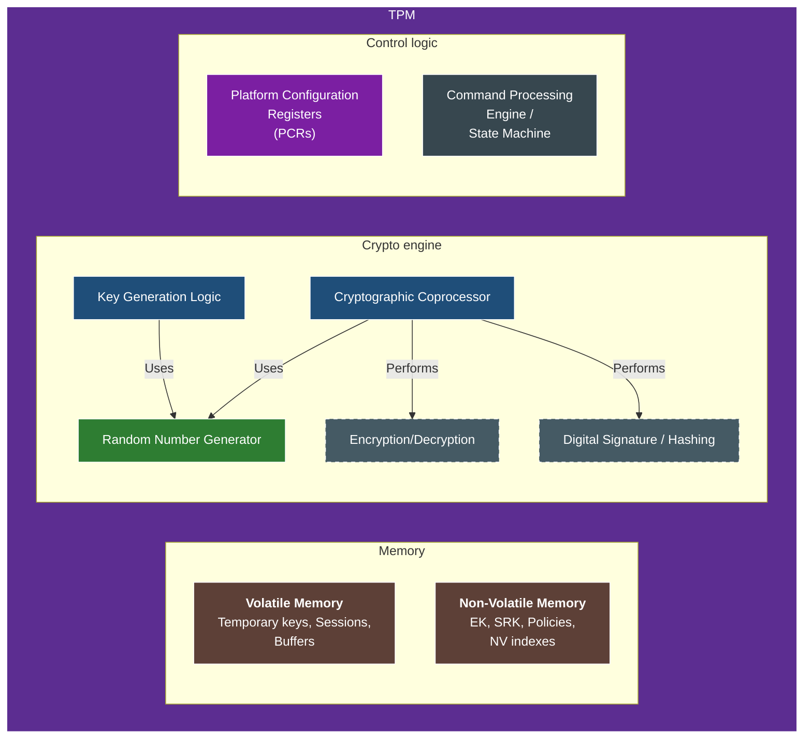

+++
title = "How to use TPM 2.0 to secure private keys"
description = "A practical guide to generating, storing, and using private keys with hardware-backed protection"
authors = ["Victor Lyuboslavsky"]
image = "tpm-key-hierarchy-headline.png"
date = 2025-07-02
categories = ["Software Development", "Security"]
tags = ["Cyber Security", "Application Security", "Golang"]
draft = false
+++

- [TPM architecture](#tpm-architecture)
- [TPM key storage](#tpm-key-storage)
- [TPM key hierarchy model](#tpm-key-hierarchy-model)
- [TPM signing](#tpm-signing)

Trusted Platform Module (TPM) is a secure cryptoprocessor for many security applications requiring strong device
identity, data protection, and platform integrity. Some uses include:

- Device identity and attestation
- Secure boot
- Key storage
- Disk encryption
- Digital signatures

TPM 1.2 was standardized in 2009 as ISO/IEC 11889:2009. TPM 2.0, the most common today, came out in 2015 with the
[ISO/IEC 11889:2015 standard](https://www.iso.org/standard/66510.html). The link is for part 1 of the standard (out of
4).

Although many people think of TPM as a hardware chip, it has many possible implementations. They are:

- A dedicated TPM chip
- Integrated TPM as part of another chip (e.g., an ARM-based SoC)
- Firmware TPMs (fTPMs) that run in the CPU's trusted execution environment
- Virtual TPMs (vTPMs) are provided by hypervisors to provide security to virtual environments
- Software TPMs are emulators of TPMs. They are helpful for development purposes

In this article, we will focus on the use case of storing a private key in TPM 2.0.

## TPM architecture



This TPM architecture diagram illustrates the internal components of a Trusted Platform Module, highlighting its secure
cryptographic engine, non-volatile and volatile memory, and control subsystems. Key elements include the cryptographic
coprocessor, random number generator, and key generation logic, all operating within a hardware-isolated boundary. The
platform configuration registers (PCRs) and command processing engine manage system state and policy enforcement, while
non-volatile memory stores persistent keys and metadata. Non-volatile storage includes the Endorsement Key (EK), a
unique, factory-installed identity key, and the Storage Root Key (SRK), which anchors the TPM's key hierarchy.

## TPM key storage

TPM defines four main authorization hierarchies, each rooted in a different seed and intended for various use cases:

| Hierarchy       | Seed Used          | Purpose                             |
| --------------- | ------------------ | ----------------------------------- |
| **Owner**       | _Storage Seed_     | Storage keys, general-purpose keys  |
| **Endorsement** | _Endorsement Seed_ | Identity, attestation (e.g. EK)     |
| **Platform**    | _Platform Seed_    | Firmware-level trust & control      |
| **Null**        | _(None)_           | Ephemeral keys not tied to any seed |

Each hierarchy has:

- Its own **seed**
- Its own **authorization policy** (e.g., owner password)
- Its own **logical namespace** for creating keys

We will focus on the **Owner** hierarchy.

While TPMs are capable of securely storing cryptographic keys, most applications avoid storing keys directly in the TPM
in practice. This is because the amount of available non-volatile storage varies significantly between TPM models and is
often limited. Instead, keys are typically generated or loaded temporarily into the TPM or stored externally in
encrypted form and only used inside the TPM when needed.

## TPM key hierarchy model

In addition to the authorization hierarchies, the TPM organizes keys in a hierarchy. This model helps balance
performance, security, and the TPM's limited storage.

Storage Seed → Parent Key → Child Key

### Storage seed (Owner)

The seed is a non-exportable, hardware-internal value that acts as the TPM's true root key. You can't access it, but you
can use it indirectly. **The storage seed cannot be modified.**

### Parent key

Parent keys are stored persistently in TPM non-volatile memory or reloaded as needed. A parent key is any key used to
encrypt (wrap) one or more child keys. The parent key must be already loaded in the TPM to load/use any of its children.

When creating a parent key, the TPM **does not randomly generate** the key unless you explicitly ask it to. Instead, if
you provide:

- The same hierarchy (e.g., the Owner ties it to the storage seed)
- The same key template (same attributes, algorithms, policy)
- The same authorization (e.g., null password)

... then the TPM will derive **the exact same key** every time.

The TPM uses a deterministic KDF (key derivation function). This determinism means the application does not need to
store the parent key explicitly. It can be recreated when needed.

#### Create a parent key example

[tpm2-tools](https://github.com/tpm2-software/tpm2-tools) is the official CLI toolset for interacting with TPM 2.0 via
the TPM2 Software Stack (tss). Install it on Ubuntu/Debian like:

```bash
sudo apt update
sudo apt install tpm2-tools
```

The `tpm2-tss` should already be installed or pulled in as part of `tpm2-tools` installation. You can check for these
libraries with: `dpkg -l | grep libtss2`

To interact with the TPM device using `tpm2-tools`, the user must either be root or a member of the `tss` group, which
has access to `/dev/tpmrm0`. To add the user to the `tss` group, you can:

```bash
sudo usermod -aG tss $USER
```

Then **log out and log back in** for the group change to take effect.

Our examples use `tpm2-tools` version 5.6. See
[the tpm2-tools documentation](https://tpm2-tools.readthedocs.io/en/latest/) for details. To create a transient parent
key in TPM 2.0 using TSS (tpm2-tools) CLI, use the `tpm2_createprimary` command:

```bash
tpm2_createprimary \
  --hierarchy=owner \
  --key-algorithm=rsa \
  --hash-algorithm=sha256 \
  --attributes="fixedtpm|fixedparent|sensitivedataorigin|userwithauth|decrypt|restricted" \
  --key-context=parent.ctx
```

This command creates the `parent.ctx` context file, which can be used in later commands.

Below is an equivalent example of creating the parent key using the [go-tpm](https://github.com/google/go-tpm) library:

```go
// Create a parent key template with the required attributes
parentTemplate := tpm2.New2B(tpm2.TPMTPublic{
  Type:    tpm2.TPMAlgRSA,
  NameAlg: tpm2.TPMAlgSHA256,
  ObjectAttributes: tpm2.TPMAObject{
    FixedTPM:            true, // bound to TPM that created it
    FixedParent:         true, // Required
    SensitiveDataOrigin: true, // key material generated internally
    UserWithAuth:        true, // Required, even if we use nil password
    Decrypt:             true, // Allows key to be used for decryption/unwrapping
    Restricted:          true, // Limits use to decryption of child keys
  },
  Parameters: tpm2.NewTPMUPublicParms(
    tpm2.TPMAlgRSA,
    &tpm2.TPMSRSAParms{
      KeyBits: 2048,
      Symmetric: tpm2.TPMTSymDefObject{
        Algorithm: tpm2.TPMAlgAES,
        KeyBits: tpm2.NewTPMUSymKeyBits(
          tpm2.TPMAlgAES,
          tpm2.TPMKeyBits(128),
        ),
        Mode: tpm2.NewTPMUSymMode(
          tpm2.TPMAlgAES,
          tpm2.TPMAlgCFB,
        ),
      },
    },
  ),
})

primaryKey, err := tpm2.CreatePrimary{
  PrimaryHandle: tpm2.TPMRHOwner,
  InPublic:      parentTemplate,
}.Execute(t.device)
if err != nil {
  return err
}
```

### Child key

A **child key** in TPM 2.0 is created **under a parent key** (which must already exist or be loaded). The child key is
**wrapped (encrypted)** by the parent key and is not usable on its own—it must be **unwrapped (loaded)** by the TPM
using the correct parent key.

To create a child ECC key using `tpm2-tools`, use the `tpm2-create` command, like:

```bash
tpm2_create \
  --parent-context=parent.ctx \
  --key-algorithm=ecc_nist_p256 \
  --hash-algorithm=sha256 \
  --attributes="fixedtpm|fixedparent|sensitivedataorigin|userwithauth|sign|decrypt" \
  --public=child.pub \
  --private=child.priv
```

This command creates the `child.pub` and `child.priv` files which can be used in later commands.

To load the child key into the TPM using `tpm2-tools`, use the `tpm2_load` command, like:

```bash
tpm2_load \
  --parent-context=parent.ctx \
  --public=child.pub \
  --private=child.priv \
  --key-context=child.ctx
```

This command creates the `child.ctx` context file which can be used later.

Below is an equivalent example of creating the child key using the [go-tpm](https://github.com/google/go-tpm) library,
loading the key into the TPM, and saving the context for subsequent reuse:

```go
// Create an ECC key template for the child key
eccTemplate := tpm2.New2B(tpm2.TPMTPublic{
  Type:    tpm2.TPMAlgECC,
  NameAlg: tpm2.TPMAlgSHA256,
  ObjectAttributes: tpm2.TPMAObject{
    FixedTPM:            true,
    FixedParent:         true,
    SensitiveDataOrigin: true,
    UserWithAuth:        true, // Required even if the password is nil
    SignEncrypt:         true,
    Decrypt:             true,
  },
  Parameters: tpm2.NewTPMUPublicParms(
    tpm2.TPMAlgECC,
    &tpm2.TPMSECCParms{
      CurveID: curveID,
    },
  ),
})

// Create the key under the transient parent
createKey, err := tpm2.Create{
  ParentHandle: parentKeyHandle,
  InPublic:     eccTemplate,
}.Execute(t.device)
if err != nil {
  return err
}

// Load the key
loadedKey, err := tpm2.Load{
  ParentHandle: parentKeyHandle,
  InPrivate:    createKey.OutPrivate,
  InPublic:     createKey.OutPublic,
}.Execute(t.device)
if err != nil {
  return err
}

// Save the key context
keyContext, err := tpm2.ContextSave{
  SaveHandle: loadedKey.ObjectHandle,
}.Execute(t.device)
if err != nil {
  return err
}
```

#### 📁 Where can a child key be persisted?

The most common approach is to persist the child keys outside the TPM.

- You store the child's public key and private key blob on a disk, in a secure database, or in a file system.
- When you need to use the key, you **load it into the TPM**

This storage approach is safe because:

- The private key is always encrypted with the TPM's parent key
- Only the correct TPM with the correct parent key can decrypt/use it

There is also a de facto standard for
[storing TPM 2.0 key files using ASN.1 structure](https://www.hansenpartnership.com/draft-bottomley-tpm2-keys.html).
OpenConnect VPN and several other tools use this standard.

## TPM signing

TPM can sign data using the child key. The output signature is in raw binary.

To sign using `tpm2-tools`, use the `tpm2_sign` command, like:

```bash
# Create dummy data and a dummy digest
echo "hello world" > data.in.raw
cat data.in.raw | openssl dgst -sha256 -binary > digest.bin
# Sign the digest
tpm2_sign \
  --key-context=child.ctx \
  --hash-algorithm=sha256 \
  --digest \
  --format=plain \
  --signature=signature.plain digest.bin

# Now we will verify the signature using openssl.
# First, we need the child public key in PEM format.
tpm2_readpublic \
  --object-context=child.ctx \
  --output=child.pem \
  --format=pem
# Now, we can verify the signature.
openssl dgst \
  -sha256 \
  -verify=child.pem \
  -keyform=pem \
  -signature=signature.plain \
  data.in.raw
```

Below is an example of signing using the [go-tpm](https://github.com/google/go-tpm) library:

```go
sign := tpm2.Sign{
  KeyHandle: childKeyHandle,
  Digest: tpm2.TPM2BDigest{
    Buffer: digest,
  },
  InScheme: tpm2.TPMTSigScheme{
    Scheme: tpm2.TPMAlgECDSA,
    Details: tpm2.NewTPMUSigScheme(
      tpm2.TPMAlgECDSA,
      &tpm2.TPMSSchemeHash{
        HashAlg: hashAlg,
      },
    ),
  },
  Validation: tpm2.TPMTTKHashCheck{
    Tag: tpm2.TPMSTHashCheck,
  },
}

rsp, err := sign.Execute(tpm)
if err != nil {
  return err
}

// Get the ECDSA signature
ecdsaSig, err := rsp.Signature.Signature.ECDSA()
if err != nil {
  return err
}
```

## Further reading

- **[HTTP message signatures](../http-message-signatures/)**  
  Explore RFC 9421 for securing API requests with cryptographic signatures. See how industry leaders implement message
  signing and learn practical strategies for key distribution and replay attack prevention.

- **[Mutual TLS intro and hands-on example: mTLS Hello World](../mtls-hello-world/)**  
  A quick and practical introduction to mutual TLS (mTLS), including how client certificate authentication works and how
  to try it with a simple example.

- **[Comparing mTLS and HTTP signatures](../mtls-vs-http-signature/)**  
  A practical guide to securing HTTP requests with transport-layer or application-layer authentication. Understand the
  tradeoffs between connection-level and message-level security approaches.

- **[What is a VLAN and why you need it in your home network](../why-you-need-vlan/)**  
  Learn how VLANs isolate devices to improve home network security and what you need to configure on your router,
  switch, and access points.

## Watch the explanation of securing private keys with TPM



_Note:_ If you want to comment on this article, please do so on the YouTube video.
