+++
title = "Understanding HTTP message signatures: A developer's guide"
description = "Master HTTP message signatures for API security. Learn the RFC 9421 standard, see real implementations from industry leaders, and get practical Node.js code examples"
authors = ["Victor Lyuboslavsky"]
image = "http-message-signatures.png"
date = 2025-12-09
categories = ["Security", "Software Development"]
tags = ["Application Security", "mTLS", "JWT", "HTTP Message Signatures"]
draft = false
+++

- [What are HTTP message signatures?](#what-are-http-message-signatures)
- [How HTTP message signatures compare to alternatives](#how-http-message-signatures-compare-to-alternatives)
- [Technical details of HTTP message signatures](#technical-details-of-http-message-signatures)
- [Example implementation](#example-implementation)
- [Does your API need message-level authentication?](#does-your-api-need-message-level-authentication)

If you've ever tried to improve security in a real organization, you know how it feels. You come up with what seems like
a good idea, but the moment you share it, someone says:

> That's too custom. That's too complicated. That'll break our infrastructure. We don't have time for that.

It's frustrating. You’re not trying to slow anyone down, you're trying to make things safer.

That was me a few months ago. Our client/server API used a token stored in a file on a client, and we wanted to make it
more secure. I proposed a custom security solution to the team, and was met with questions and doubts. But that
rejection actually led me to something better. I really dug into the security solutions in the industry, and I found the
standard called **HTTP Message Signatures**, [RFC 9421](https://datatracker.ietf.org/doc/rfc9421/). It turns out the
solution already existed. I just didn't know where to look.



## What are HTTP message signatures?

You sign receipts, contracts, and maybe your kid's permission slip. A signature means: this came from me. But on the
web, most messages are unsigned. Anyone could forge them. HTTP Message Signatures change that. They make digital
communication accountable again. The server knows that the message actually came from the right client and wasn't
modified by a proxy.

So why do we need this? When two systems talk over HTTP, the server sees a request, but it doesn't really know who sent
it, or if the message changed on the way. The server doesn't know if a bad actor is impersonating the client or
intercepted the message and modified the contents.

To trust the message, the server needs some way to verify that the message came from the client. With HTTP message
signatures, the server must have the public key of the client. The client signs the message with its private key, and
the server verifies the signature with the public key.


With HTTP message signatures, the client signs specific parts of the HTTP request, such as method, target URI, headers,
and a hash of the request body. The signature tells the server:

- Who sent the message
- That the message hasn't been tampered with
- Which parts of the message are covered by the signature

HTTP message signatures are added in the HTTP request headers. This means that the signature can be added by a proxy.
The client could be a legacy system, and we can simply add a proxy to make it more secure.

```mermaid
%%{init: {'theme':'base', 'themeVariables': { 'primaryColor':'#E3F2FD','primaryTextColor':'#1565C0','primaryBorderColor':'#1976D2','lineColor':'#424242','secondaryColor':'#FFF3E0','tertiaryColor':'#E8F5E9'}}}%%
sequenceDiagram
    participant LC as 🖥️ Legacy client
    participant P as 🔄 Modern proxy<br/>(signature creation)
    participant S as ☁️ Server

    LC->>P: HTTP request<br/>(no signature)
    P->>P: Sign message with<br/>private key
    P->>S: HTTP request<br/>(+ signature headers)
    S->>S: Verify signature
    S-->>P: Response
    P-->>LC: Response
```



## How HTTP message signatures compare to alternatives

### API keys: simple but limited

API keys are like shared passwords. You include them in a header or query parameter, and the server knows someone with
that key made the request. They're simple and widely used.

But here's the problem: API keys only authenticate the client, they don't protect message integrity. If a proxy, cache,
or malicious actor modifies the message in transit, there's no proof of what changed. The server can't tell whether the
message body or headers were tampered with after the client sent them.

HTTP message signatures fix that. Instead of just authenticating the connection, they sign the message itself (method,
headers, a hash of the body, and more). The server can verify not only who sent the message, but also that nothing was
modified along the way.

### JWT: a fancier API key

JWT (JSON Web Token) is everywhere. JWTs became the de facto identity token format in OAuth 2.0, where they're sent in
the Authorization header. That pattern is now universal for most API tokens, even if you don't use OAuth explicitly. The
industry standard across Google, AWS, Okta, GitHub, and others is `Authorization: Bearer <JWT>`.

```
Authorization: Bearer <JWT-header>.<JWT-payload>.<JWT-signature>

Header:
{
  "alg": "HS256",
  "typ": "JWT"
}

Payload:
{
  "sub": "1234567890",
  "name": "John Doe",
  "iat": 1730630400
}
```

The problem is that a JWT only signs its own contents (the claims inside the token itself). It doesn't sign the HTTP
request. If someone intercepts a valid JWT, they can use it in a completely different request. They could change the
method from GET to DELETE, modify the request body, or alter other headers. The server will validate the JWT and accept
it, because the token itself is legitimate.

HTTP message signatures prevent request modification by binding the signature to the specific request components
(method, path, headers, body). An attacker can't change a signed request without breaking the signature.

### mTLS: strong but operationally complex

mTLS (mutual TLS) is the gold standard for authentication when both client and server present certificates during the
TLS handshake. It's built into the protocol, fast, and well-supported across operating systems and browsers.

But mTLS is all-or-nothing. You can't easily enforce it on just one endpoint or route. It's typically applied to the
entire connection. It also requires TLS termination at a layer that can verify client certificates. If your load
balancer terminates TLS, it needs to handle certificate verification and pass the identity downstream. This makes mTLS
difficult to deploy in many real-world architectures.

HTTP message signatures work at the application layer. They don't care where TLS terminates. You can verify signatures
at the destination server, apply them per-route, and enforce them selectively based on your requirements. We cover the
tradeoffs in detail in [mTLS vs HTTP signature faceoff](../mtls-vs-http-signature/).

## Who is using HTTP message signatures?

HTTP message signatures are gaining real traction across the industry. Here's who's already using them and why.

**OpenAI**
[signs requests from their ChatGPT agent](https://help.openai.com/en/articles/11845367-chatgpt-agent-allowlisting) to
solve the bot verification problem. You've probably heard complaints about small sites being overwhelmed by AI bots.
Without signatures, it was nearly impossible to tell which AI company was responsible for the traffic. Now, CDNs and
firewalls can verify that traffic actually came from OpenAI, not some impersonator trying to abuse their reputation.

**Cloudflare**
[built HTTP message signatures into their Verified Bots program](https://blog.cloudflare.com/verified-bots-with-cryptography).
Site owners can now whitelist legitimate bots while blocking the fakes. No more relying on IP ranges that constantly
shift or user-agent headers that anyone can spoof. The cryptographic signature proves the bot's identity.

**Mastodon** uses HTTP message signatures to protect the federated network. Say you create a Mastodon account on
mastodon.social. When you post something, your server sends that post to other Mastodon servers across the federation.
Without signatures, a malicious server could impersonate mastodon.social and send fake posts claiming they came from
you. Your followers on other servers would see these forged posts in their feeds, and there'd be no way to tell they
weren't legitimate.

Mastodon uses HTTP message signatures to secure federated ActivityPub communication. When one Mastodon server receives
activities from another, it requires cryptographic proof that the sending actor actually authored the request. Without
signatures, any server could impersonate another and inject fake posts or manipulate feeds.
[Mastodon's secure mode](https://docs.joinmastodon.org/spec/security) even requires signatures on read-only GET requests
between federated instances.

**Amazon** requires HTTP message signatures for third-party payment providers accessing their Selling Partner API in the
EU. This isn't optional. It's
[PSD2 compliance](https://developer-docs.amazon.com/sp-api/docs/tpp-registration-signature-guidance), which is the
Payment Services Directive 2 (PSD2) framework of the European Union. Payment providers must sign requests using their
NCA (National Competent Authority) certificate to prove they're authorized to access sensitive financial data. The
certificate's organization identifier must match the registered developer identity, or the request gets rejected.

Other standards are already building on top of HTTP message signatures.
[RFC 9635 (GNAP)](https://datatracker.ietf.org/doc/rfc9635/), finalized in October 2024, is the Grant Negotiation and
Authorization Protocol. Think of it as a more flexible alternative to OAuth 2.0. Say you want to give a third-party app
permission to access your cloud storage. The app needs to request that access from the storage provider, and the
provider needs to verify that the requests are actually coming from the legitimate app, not an imposter. GNAP uses HTTP
message signatures as one way for the app to prove its identity during the authorization negotiation process (alongside
mTLS and other methods).

There's also a draft for an
[HTTP Message Signatures Directory](https://datatracker.ietf.org/doc/draft-meunier-http-message-signatures-directory).
The problem? RFC 9421 assumes verifiers already have the signer's public key through some out-of-band mechanism. That
creates deployment friction. The directory draft solves this by defining a standard
`.well-known/http-message-signatures-directory` endpoint where clients can publish their signing keys in JWKS format.
Now verification can happen dynamically, even for previously unknown signers.

## Who is NOT using HTTP message signatures?

Most companies that aren't using HTTP message signatures already have something that works. They built their own
solution years ago, and migrating to a standard may not be high on the priority list when the current system isn't
broken.

Apple's MDM (Mobile Device Management) protocol uses a detached
[CMS signature](https://datatracker.ietf.org/doc/rfc5652/) with a custom header. GitHub signs webhook payloads with
HMAC-SHA256 and a shared secret. These custom approaches accomplish the same goal (verifying message integrity and
origin) but they're not interoperable. Every vendor implements their own scheme, and clients have to learn each one.

The good news? RFC 9421 supports both asymmetric keys (like RSA and ECDSA) and symmetric keys (like HMAC-SHA256).
Organizations using HMAC-based signing today could migrate to the standard without completely redesigning their
cryptography. The challenge isn't technical capability. It's finding the time and justification to migrate working
systems to a common standard.

### Why standardization matters

Here's the real value of a standard like RFC 9421: you don't have to decipher someone's custom security scheme every
time you integrate with a new API.

Right now, if you want to verify GitHub webhooks, you read their docs, implement HMAC-SHA256 with their specific header
format, and write custom verification logic. Different header names, different signature formats, different
canonicalization rules. Every vendor reinvents the wheel.

With a standard, libraries can implement signature verification once. Your application code doesn't need vendor-specific
logic for each API. The server publishes its public key, the client signs requests according to RFC 9421, and
verification just works. Same headers, same signature format, same verification process.

This also means security tooling gets better. Monitoring tools can inspect and validate signatures without custom
parsers for each vendor. Security audits become easier when everyone's using the same approach.

Standards reduce friction. They make security more accessible. And they prevent the situation where every team builds
their own half-baked signing scheme that's subtly broken in different ways.

## Technical details of HTTP message signatures

RFC 9421 is a "Proposed Standard" from the IETF (Internet Engineering Task Force). That means it's fully approved,
stable, and ready for implementation. This is the same standards level where almost all Internet protocols live (HTTP,
TLS, DNS, etc.).

### How it works

HTTP message signatures use two headers to sign requests:

**Signature-Input**: Specifies what you're signing (which headers, which parts of the request) and metadata like
creation time and key identifier.

**Signature**: Contains the actual cryptographic signature.

Here's a real example from the RFC:

```
POST /foo?param=value&pet=dog HTTP/1.1
Host: example.com
Date: Tue, 20 Apr 2021 02:07:55 GMT
Content-Type: application/json
Content-Length: 18
Signature-Input: sig1=("@method" "@authority" "@path"
  "content-type" "content-length");created=1618884475;
  keyid="test-key"
Signature: sig1=:Base64SignatureGoesHere=:

{"hello": "world"}
```

The `Signature-Input` header says: "I'm signing the HTTP method, the authority (host and port), the path, content-type,
and content-length." The `Signature` header contains the actual signature of those components.

### What can you sign?

You can sign two types of components:

**HTTP headers**: Any header from the request (like `content-type`, `authorization`, etc.). Header names are lowercased.

**Derived components** (these start with `@`):

- `@method`: The HTTP method (GET, POST, etc.)
- `@target-uri`: The full request URI
- `@authority`: The host and port (e.g., `example.com:8080`)
- `@scheme`: The URI scheme (`http` or `https`)
- `@path`: The request path
- `@query`: The query string
- `@status`: The HTTP response code (for signing responses)

You pick which components to sign based on what matters for your security. Signing `@method` and `@path` prevents
someone from changing a GET to a DELETE.

To protect the request body, you don't sign it directly. Instead, you calculate a cryptographic hash of the body and
include it in a `Content-Digest` header (defined in [RFC 9530](https://datatracker.ietf.org/doc/rfc9530/)). Then you
sign that header. For example:

```
Content-Digest: sha-256=:X48E9qOokqqrvdts8nOJRJN3OWDUoyWxBf7kbu9DBPE=:
```

This `content-digest` header becomes one of the signed components. If anyone tampers with the body, the hash won't match
and the signature verification will fail.

### Signature metadata

The `Signature-Input` header also includes metadata parameters (after the semicolon):

- `created`: UNIX timestamp when the signature was generated (recommended for replay protection)
- `expires`: UNIX timestamp after which the signature should be rejected
- `nonce`: A random unique value to prevent replay attacks
- `keyid`: Identifier for the key used (helps the server find the right public key)
- `alg`: The algorithm used to create the signature (e.g., `rsa-pss-sha512`)
- `tag`: Application-specific identifier

In the example above, `created=1618884475` and `keyid="test-key"` tell the server when the signature was made and which
key to use for verification. These parameters are part of the RFC 9421 standard and are included in what gets signed, so
they can't be tampered with.

### How the signature is created

The client builds a "signature base" from the selected components:

```
"@method": POST
"@authority": example.com
"@path": /foo
"content-type": application/json
"content-length": 18
"@signature-params": ("@method" "@authority" "@path"
  "content-type" "content-length");created=1618884475;
  keyid="test-key"
```

Each component gets its own line with the component name in quotes, a colon, and the value. The last line contains the
signature parameters. This text is what gets signed with the private key.

### Supported algorithms

RFC 9421 initially registered these algorithms:

**Asymmetric** (public/private key pairs):

- `rsa-pss-sha512`: RSA with PSS padding and SHA-512
- `rsa-pkcs1v15-sha256`: Traditional RSA with SHA-256
- `ecdsa-p256-sha256`: Elliptic curve (P-256)
- `ecdsa-p384-sha384`: Elliptic curve (P-384)
- `ed25519`: EdDSA using edwards25519 curve

**Symmetric** (shared secrets):

- `hmac-sha256`: HMAC with SHA-256

But the list is extensible. The RFC allows implementations to support additional algorithms, including JSON Web
Signature (JWS) algorithm identifiers. IANA maintains the
[official registry](https://www.iana.org/assignments/http-message-signature/http-message-signature.xhtml) where new
algorithms can be registered. This means the standard can evolve to support new cryptographic methods as they become
available.

### Key distribution and rotation

The big question: how does the server get the client's public key?

RFC 9421 doesn't mandate a specific method. You have options:

1. **Pre-shared configuration**: Register the client's public key with the server out-of-band (API portal, configuration
   file, database).

2. **Well-known directory**: Use the
   [HTTP Message Signatures Directory](https://datatracker.ietf.org/doc/draft-meunier-http-message-signatures-directory)
   draft to publish keys at `.well-known/http-message-signatures-directory`.

3. **Certificate-based**: Use X.509 certificates and reference them via `keyid`.

The `keyid` parameter in the signature identifies which key to use. This supports key rotation. You can even include
multiple signatures in a single request (one with the old key, one with the new key) during rotation periods.

IANA maintains the
[registry of signature algorithms and parameters](https://www.iana.org/assignments/http-message-signature/http-message-signature.xhtml)
so implementations stay compatible.

## Example implementation

We implemented a simple demo app that demonstrates how to sign and verify HTTP requests with RFC 9421 in Node.js. The
app is available on GitHub: https://github.com/getvictor/http-message-signatures

There are many JavaScript libraries that implement HTTP message signatures. Many companies also don't use libraries and
do their own implementation of the standard.



For our demo we chose https://github.com/dhensby/node-http-message-signatures for the following reasons:

1. Cleaner, more intuitive API

- Simpler function signatures and better TypeScript support
- More conventional Node.js patterns
- Easier to integrate with Web Crypto API

2. Better documentation and examples

- Clear, comprehensive examples in the README
- Well-documented API surface
- Good inline code comments

3. Proven stability

- Version 1.0.4
- Widely used

4. Better compatibility

- No unusual dependencies (only `structured-headers`)
- Easy integration with Express middleware

Before sending a signed request, the client needs to give the server its public key. The server can then use that key to
verify the signature. We chose to use a dedicated `/admin` endpoint for this purpose.

Once server has the client's public key. Here's a snippet of the client code that signs a request:

```typescript
export async function signAndSendRequest(
  keys: ClientKeys,
  method: string,
  path: string,
  body?: any,
  tamper: boolean = false
): Promise<Response> {
  const url = `${BASE_URL}${path}`;
  const bodyString = body ? JSON.stringify(body) : undefined;

  // Compute Content-Digest for the body
  let contentDigest: string | undefined;
  if (bodyString) {
    contentDigest = computeDigest(bodyString, 'sha-256');
  }

  // Prepare the message object for signing
  // SignRequest comes from 'http-message-signatures' library
  const message: SignRequest & { body?: string } = {
    method: method.toUpperCase(),
    url,
    headers: {
      'content-type': 'application/json',
    },
  };

  if (contentDigest) {
    message.headers['content-digest'] = contentDigest;
  }

  if (bodyString) {
    message.body = bodyString;
  }

  // Create signer function
  const signer = async (data: Buffer): Promise<Buffer> => {
    const signature = await webcrypto.subtle.sign('Ed25519', keys.privateKey, data);
    return Buffer.from(signature);
  };

  // Generate nonce for replay protection
  const nonce = generateNonce();

  // Sign the message, using `signMessage` of `http-message-signatures` library
  const signedMessage = await httpbis.signMessage(
    {
      key: {
        id: keys.kid,
        alg: 'ed25519',
        sign: signer,
      },
      fields: contentDigest
        ? ['@method', '@target-uri', 'content-type', 'content-digest']
        : ['@method', '@target-uri'],
      params: ['keyid', 'alg', 'created', 'expires', 'nonce'],
      paramValues: {
        created: new Date(),
        expires: new Date(Date.now() + 5 * 60 * 1000), // 5 minutes
        nonce: nonce,
      },
    },
    message
  );

  const signature = signedMessage.headers['signature'] || signedMessage.headers['Signature'];
  const signatureInput = signedMessage.headers['signature-input'] || signedMessage.headers['Signature-Input'];
```

The signing process: compute the Content-Digest hash for the body, build a message object with method and headers,
create an Ed25519 signer function, configure which components to sign (`@method`, `@target-uri`, `content-digest`) with
replay protection parameters (`created`, `expires`, `nonce`), and extract the signature headers.

Here's a snippet of the server code that verifies the signature:

```typescript
export async function verifySignatureMiddleware(
  req: Request,
  res: Response,
  next: NextFunction
): Promise<void> {
  const endpoint = req.path;
  const method = req.method;

  // Check for required headers
  const signatureInputHeader = req.headers['signature-input'];
  const signatureHeader = req.headers['signature'];
  const contentDigestHeader = req.headers['content-digest'];
  // ...

  // Verify Content-Digest if present (do this early for efficiency)
  // ...

  // Perform cryptographic signature verification
  try {
    // Construct the message object for verification
    const message = {
      method: req.method,
      url: `${req.protocol}://${req.get('host')}${req.originalUrl}`,
      headers: {} as Record<string, string>,
    };

    // Copy headers to lowercase keys (RFC 9421 requires lowercase)
    // ...

    // Map algorithm names to library format
    const mapAlgorithmToLibraryFormat = (alg: string): string => {
      const mapping: Record<string, string> = {
        'EdDSA': 'ed25519',
        // ...
      };
      return mapping[alg] || alg.toLowerCase();
    };

    // Clock skew tolerance for timestamp validation
    const CLOCK_SKEW_SECONDS = 5 * 60; // 5 minutes

    // Verify the signature using the library
    // The keyLookup callback receives parsed parameters from the library
    const verificationResult = await httpbis.verifyMessage(
      {
        keyLookup: async (params: SignatureParameters) => {
          const kid = params.keyid;
          // Look up the key
          const keyRecord = db.getKey(kid);
          // Validate the key and make sure it is not revoked
          // ...

          // Check for nonce parameter (replay protection)
          if (params.nonce) {
            // Check if nonce has been used before (replay detection)
            if (db.isNonceUsed(params.nonce)) {
              // fail
            }
          }

          // Import the public key
          let publicKey: webcrypto.CryptoKey;
          if (keyRecord.algorithm === 'EdDSA') {
            publicKey = await webcrypto.subtle.importKey(
              'jwk',
              keyRecord.jwk as any,
              { name: 'Ed25519', namedCurve: 'Ed25519' } as any,
              true,
              ['verify']
            );
          } // else ...

          // Create a verifier function
          const createVerifierForKey = async (data: Buffer, signature: Buffer): Promise<boolean | null> => {
            let algorithm: string | { name: string; hash: string };
            if (keyRecord.algorithm === 'EdDSA') {
              algorithm = 'Ed25519';
            } // else ...
            return await webcrypto.subtle.verify(algorithm, publicKey, signature, data);
          };

          // Return the verifying key
          return {
            id: kid,
            algs: [mapAlgorithmToLibraryFormat(keyRecord.algorithm)],
            verify: createVerifierForKey,
          };
        },
        tolerance: CLOCK_SKEW_SECONDS,
      },
      message
    );

    // verifyMessage returns true on success, false/null on failure
    if (!verificationResult) {
      res.status(401).json(SignatureErrors.invalidSignature('Signature verification failed'));
      return;
    }

    // Store the nonce to prevent replay (if present)
    // ...
    next();
  } catch (error: any) {
    res.status(401).json(SignatureErrors.invalidSignature(error.message || 'Verification error'));
    return;
  }
```

The verification process reconstructs the message object from the incoming request and calls the library's
`verifyMessage` function. The `keyLookup` callback retrieves the client's public key using the `keyid` parameter, checks
if the nonce has been used (replay protection), imports the key via Web Crypto API, and returns a verifier function. The
library handles timestamp validation using the configured clock skew tolerance (5 minutes). If verification succeeds, we
store the nonce and proceed. If it fails, we return 401 Unauthorized.

## Replay attacks

A replay attack happens when someone captures a legitimate request and sends it again to trigger the same action a
second time. Think of it like photocopying a signed check. The signature is real, the request is valid, but you're using
it in a way that wasn't intended.

Here's the problem: HTTP message signatures protect against tampering, but they don't inherently prevent replay. An
attacker who intercepts a signed request can replay it from any machine. They don't need your private key. They just
need the complete request with its signature headers intact.

Consider this scenario: you send a signed API request to transfer $100. The signature proves the request came from you
and hasn't been modified. But if an attacker captures that request, they can send it again. And again. The signature is
still valid because the request hasn't changed.


### Defending against replay attacks

You need to make each signature single-use or time-limited. The standard way to do this is with the `created` timestamp
and `nonce` parameters we discussed earlier:

**Use `created` timestamp**: Include the current time when generating the signature. The server rejects any request
where `created` is too far from the current server time (typically 5-10 minutes). Since the timestamp is included in the
signature, an attacker can't modify it without invalidating the signature.

**Use `nonce` for critical operations**: For sensitive actions like money transfers or password resets, include a random
nonce value. The server tracks recently used nonces (cached in Redis or similar) and rejects any request that reuses a
nonce within the time window.

The `expires` parameter offers an alternative approach. Instead of relying on `created` + server-side time window
checking, you can explicitly set when a signature becomes invalid. The server simply rejects any request where the
current time is past the `expires` timestamp.

## Performance considerations

Understanding the performance characteristics of HTTP message signatures matters when you're operating at scale.

### Where the CPU load happens

HTTP message signatures shift cryptographic work to the application layer. Every single request requires signature
verification at your application server, not at the network edge or load balancer.

This is different from connection-level security like TLS or mTLS, where cryptographic operations happen during the
initial handshake and subsequent requests on that connection are cheap. With HTTP message signatures, you're adding
cryptographic operations to every request. Your application servers handle this work, not your load balancers or edge
infrastructure.

### Per-request overhead

The computational cost depends on which algorithm you choose:

- **EdDSA (ed25519)**: Fastest for verification. Modern CPUs handle this efficiently.
- **ECDSA P-256**: Good balance of security and performance. Recommended for most use cases.
- **ECDSA P-384**: Stronger security, but noticeably slower. In our production environment with high request volumes,
  switching from P-256 to P-384 required 50% more application servers to handle the same load.
- **RSA**: Slower than elliptic curve algorithms for the same security level. Verification is faster than signing, but
  still more expensive than ECDSA.
- **HMAC-SHA256**: Fastest option if you can use symmetric keys (shared secrets). No public key cryptography involved.

### What dominates the cost?

The cryptographic signature verification is what takes the most CPU cycles. Elliptic curve operations, RSA verification,
or even HMAC computation dwarf everything else.

Canonicalization (building the signature base from headers and components) is comparatively cheap. It's just string
manipulation. Unless you're signing hundreds of headers or dealing with megabyte-sized header values, the
canonicalization overhead is negligible compared to the actual crypto operation.

This means your algorithm choice matters far more than whether you sign 3 components or 10 components. The difference
between ECDSA P-256 and P-384 is significant. The difference between signing `@method` + `@path` versus signing those
plus 5 more headers is barely measurable.

### If performance becomes a concern

The main lever you have is **algorithm choice**. Use ECDSA P-256 or ed25519 unless you have specific requirements for
stronger curves. If you can use symmetric keys (HMAC-SHA256), that's even faster, but most use cases need asymmetric
cryptography.

Beyond that, you're dealing with fundamental tradeoffs. Every request needs cryptographic verification. There's no
caching (each signature is unique with different timestamps/nonces). There's no connection-level optimization
(signatures are per-request, not per-connection).

If verification is still too expensive after choosing an efficient algorithm, you need more servers. That's the cost of
application-layer message authentication.

### When does performance actually matter?

For most APIs, performance is dominated by network latency, database queries, and business logic. Unless you're
operating at very high scale (thousands of requests per second per server) or on constrained devices, the signature
verification overhead is negligible compared to everything else your application does.

But if you're building infrastructure that processes millions of requests, the CPU cost adds up. Budget for it. Test
with realistic load. Choose your algorithms based on actual measurements, not just theoretical security levels.

## Does your API need message-level authentication?

Not every API needs HTTP message signatures. If you're building a simple internal service with API keys over TLS, you're
probably fine. But there are specific situations where message signatures solve real problems.

Ask yourself these questions:

**How easy is it for someone modify the message between your client and server?** And if it happens, how big of a
security problem is it?

**Do you need to verify requests at the application server?** If your load balancer terminates TLS, can your application
trust that the request actually came from the authenticated client? Or could something between the load balancer and
your app have modified it?

**Can't use mTLS everywhere?** Maybe you have public-facing APIs where client certificate management is impractical. Or
you need per-endpoint authentication control, not all-or-nothing connection security. Message signatures work at the
application layer, giving you more flexibility.

**Are you integrating with federated systems?** If you're building something like Mastodon where servers need to trust
messages from other servers they've never seen before, message signatures with published public keys solve that cleanly.

**Do you want a standard instead of custom schemes?** Tired of implementing different signature verification for every
vendor's API? Want your clients to use a standard approach instead of your custom homebrew scheme?

If you answered yes to any of these, HTTP message signatures are worth evaluating. If not, simpler approaches might be a
better fit.

The standard exists. The libraries are available. CDNs are already supporting it. The barrier to adoption is lower than
you think.

## Further reading

- **[mTLS vs HTTP signature faceoff](../mtls-vs-http-signature/)**  
  Compare transport-layer security with application-layer message authentication. Learn which approach fits your
  architecture and when combining both methods provides the strongest protection.

- **[Mutual TLS (mTLS): building a client using the system keystore](../mtls/)**  
  Discover how to implement mutual TLS authentication while securely storing certificates and private keys using native
  system keystores on macOS and Windows.

- **[How to use TPM 2.0 to secure private keys](../how-to-use-tpm/)**  
  Protect your signing keys with hardware-backed security. This practical guide shows you how to generate, store, and
  use cryptographic keys with TPM 2.0 modules.

## Watch the conference talk based on this article



_Note:_ If you want to comment on this article, please do so on the YouTube video.
