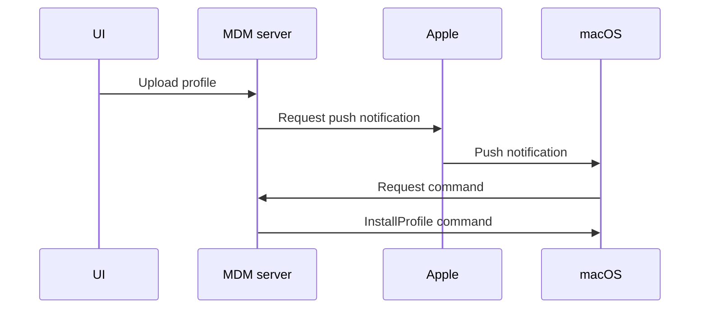
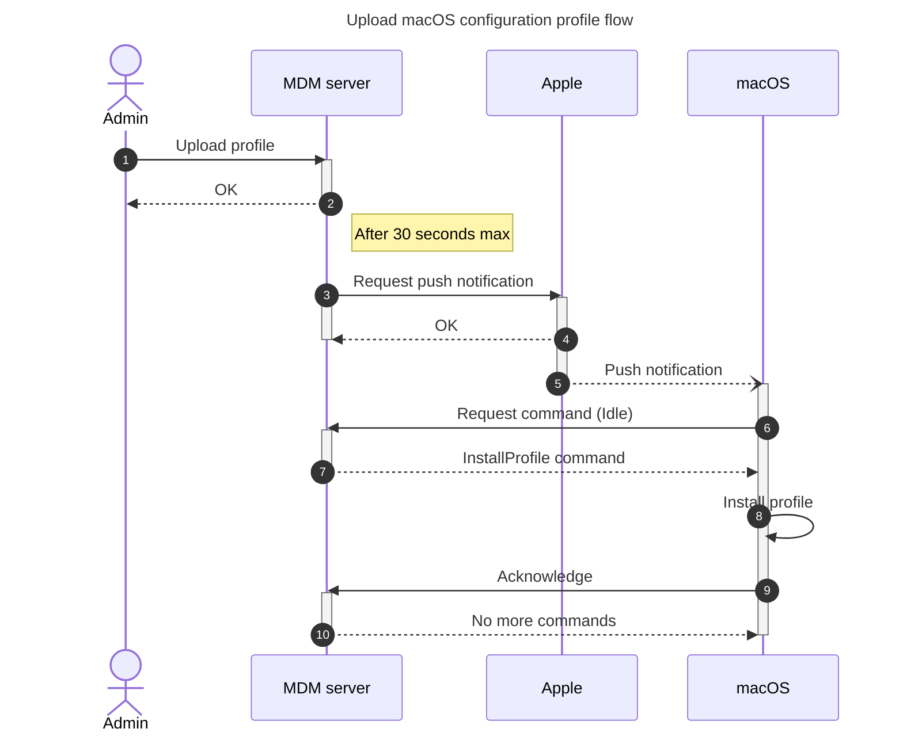
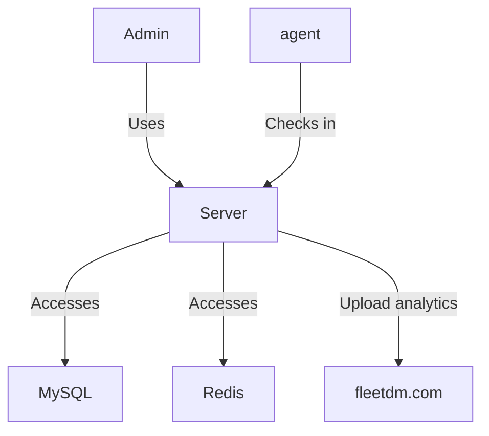
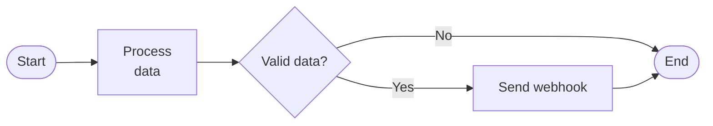
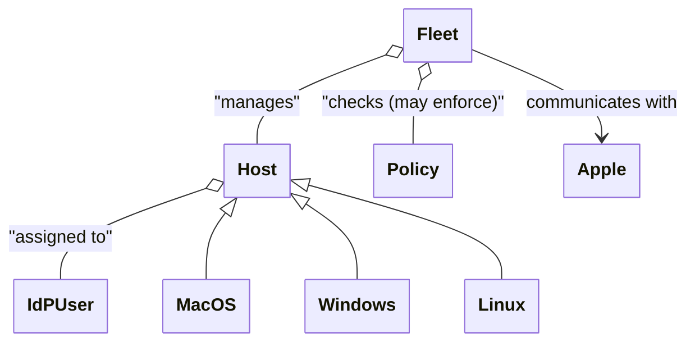
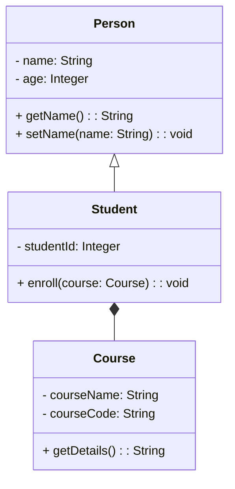
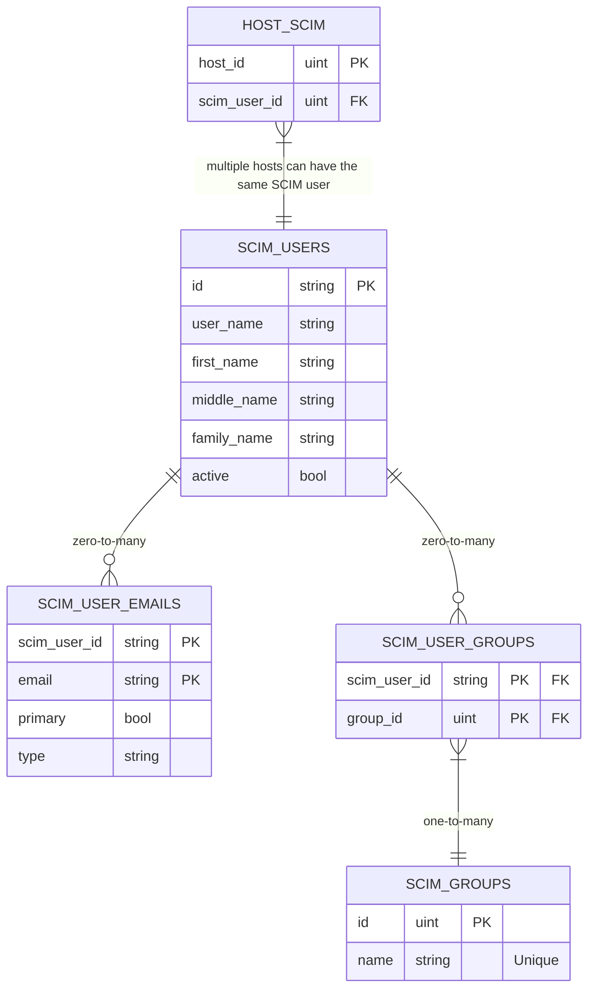

+++
title = "4 key Mermaid diagrams for software developers"
description = "Introduction to diagramming with Mermaid for software engineers"
authors = ["Victor Lyuboslavsky"]
image = "mermaid-intro-headline.png"
date = 2025-03-26
categories = ["Software Development"]
tags = ["Software Architecture", "Hello World"]
draft = false
+++

## Importance of technical diagrams

Diagrams are an effective way to communicate technical concepts to other engineers or business stakeholders. They even
help us better understand technical concepts while creating the diagrams. Effective senior engineers frequently use
diagrams in their documentation and presentations. The top Mermaid diagrams are:

- [Sequence diagrams](#sequence-diagrams)
- [Flowcharts](#flowcharts)
- [Class diagrams](#class-diagrams)
- [Entity relationship diagrams (ERDs)](#entity-relationship-diagrams-erds)

## What is Mermaid

Mermaid is a popular JavaScript-based diagramming tool that allows anyone to create diagrams using a simple text-based
syntax. Some key reasons for its popularity include:

- **Text-based syntax**: Mermaid is easy to write and version control, fitting seamlessly into code reviews and
  collaborative workflows.
- **Integration with Markdown**: Mermaid works well with Markdown, which is widely used in documentation and static site
  generators.
- **Integration with GitHub and GitLab**: These top Git hosting platforms allow you to put Mermaid diagrams almost
  anywhere on their site.
- **Versatility**: Mermaid supports various diagram types, from flowcharts and sequence diagrams to ERDs.
- **Automation-friendly**: Diagrams can be generated programmatically, enabling dynamic updates and integration with
  CI/CD pipelines.
- **Accessibility**: Mermaid does not need specialized software; diagrams can be created and rendered within code
  editors or browsers.

In our experience, Mermaid's text-based syntax is simple enough to be used for ad hoc diagramming, as opposed to the
proverbial "back of the napkin" drawing.

The above features make Mermaid an invaluable tool for creating maintainable technical diagrams. We recommend creating
your first diagram on [Mermaid Playground](https://www.mermaidchart.com/play) to get started.

## Sequence diagrams

Sequence diagrams depict how users and entities interact with each other over time. They are handy for modeling the flow
of messages, events, or data and are great for visualizing customer use cases, API interactions, or the behavior of
distributed systems.

We love sequence diagrams because they are clear and consistent. Mermaid displays sequence diagrams consistently, which
greatly speeds up understanding.

Below is a basic sequence diagram, which starts with the keyword `sequenceDiagram`.

```
sequenceDiagram
  UI->>MDM Server: Upload profile
  MDM Server->>Apple: Request push notification
  Apple->>macOS: Push notification
  macOS->>MDM Server: Request command
  MDM Server->>macOS: InstallProfile command
```

The above Mermaid diagram is rendered as follows:



The above syntax consists of `<entity>->><entity>: <description>`. In many cases, that's all that's necessary. We can
quickly create a simple sequence diagram to explain a flow during a meeting.

To add a title to your diagram, add the following at the top:

```
---
title: My diagram
---
```

To go beyond the basics, we recommend learning some additional syntax from
[sequence diagram docs](https://mermaid.js.org/syntax/sequenceDiagram.html):

- `actor`: Actors (aka people)
- Aliases
- `-->>`: Dotted line with arrow for responses
- `--)`: Dotted line with empty arrow for async messages
- `activate <entity>` and `deactivate <entity>`: Activations of actors
- Loops(`loop`), alternative paths(`alt` and `else`), and parallel actions(`par`)
- `autonumber`: Sequence numbers
- Notes

Here is the updated diagram with additional syntax:

```
---
title: Upload macOS configuration profile flow
---
sequenceDiagram
  autonumber
  actor Admin
  participant mdm as MDM server
  Admin->>mdm: Upload profile
  activate mdm
  mdm-->>Admin: OK
  deactivate mdm
  Note right of mdm: After 30 seconds max
  mdm->>Apple: Request push notification
  activate mdm
  activate Apple
  Apple-->>mdm: OK
  deactivate mdm
  Apple--)macOS: Push notification
  deactivate Apple
  activate macOS
  macOS->>mdm: Request command (Idle)
  activate mdm
  mdm-->>macOS: InstallProfile command
  deactivate mdm
  macOS->>macOS: Install profile
  macOS->>mdm: Acknowledge
  activate mdm
  mdm-->>macOS: No more commands
  deactivate mdm
  deactivate macOS
```



## Flowcharts

Flowcharts are graphical representations of processes, workflows, or decision logic. They use standardized symbols, such
as rectangles, diamonds, and arrows, to illustrate the flow of steps or tasks visually. Flowcharts are generic diagrams
that can be adapted to any purpose. They are often used to explain concepts to non-technical stakeholders.

Below is a basic flowchart diagram:

```
flowchart
  Admin-- "Uses" --->Server
  agent-- "Checks in" --->Server
  Server-- "Accesses" --->MySQL
  Server-- "Accesses" --->Redis
  Server-- "Upload analytics" --->fleetdm.com
```

Which renders as follows:



The above example is a simple block diagram that can quickly demonstrate the basic parts of your
system/container/component. Explore additional syntax at [flowchart docs](https://mermaid.js.org/syntax/flowchart.html).

Here is another flowchart example:

```
flowchart LR
  S([Start])
  PD[Process
  data]
  E([End])
  S --> PD
  PD --> V{Valid data?}
  V -- "No" ---> E
  V -- "Yes" ---> W[Send webhook]
  W --> E
```

Which renders as follows:



We defined some of the elements up front. The `Process data` rectangle contains multi-line text.

Note the direction of the flowchart is left-to-right, as specified by `LR` after `flowchart`. The direction options are:

- `TB`: Top-to-bottom
- `BT`: Bottom-to-top
- `RL`: Right-to-left
- `LR`: Left-to-right

### Standard symbols used in flowcharts

Flowcharts use a variety of standardized symbols to represent different types of actions, processes, and decisions.
Below are some of the most commonly used symbols:

1. **Terminator (Oval)**

- Represents the start or end of a process.
- Example: `([Start])` or `([End])`.

2. **Process (Rectangle)**

- Represents a step or task in the process.
- Example: `[Calculate sum]`.

3. **Decision (Diamond)**

- Represents a decision point with two or more possible outcomes.
- Example: `{Is user authenticated?}`.

4. **Arrow (Line)**

- Represents the flow or direction of the process.
- Example: Connects steps in a process.

5. **Input/Output (Parallelogram)**

- Represents input to or output from a process.
- Example: `[/User enters credentials/]`.

6. **Database (Cylinder)**

- Represents a data store
- Example: `[(MySQL)]`.

Additional symbols may be used for specialized diagrams or contexts, depending on the needs of the specific workflow.

## Class diagrams

A **class diagram** is one of the core components of the Unified Modeling Language (UML) and is used to visually
represent the static structure of a system. Traditionally, it models classes, their attributes, operations (methods),
and the relationships among the classes in the system.

However, we found that the most helpful use of class diagrams is to model relationships between higher-level entities.
We can also model higher-level entities with a flowchart, but the benefit of using a class diagram is the ability to use
standard relationships.

Below is an example diagram modeling some domain concepts:

```
---
config:
  class:
    hideEmptyMembersBox: true
---
classDiagram
  Fleet o-- Host: "manages"
  Fleet o-- Policy: "checks (may enforce)"
  Host o-- IdPUser: "assigned to"
  Host <|-- MacOS
  Host <|-- Windows
  Host <|-- Linux
  Fleet --> Apple: communicates with
```

It renders as follows:



The syntax is straightforward, as in the basic examples of previous diagrams, and we can quickly throw together this
type of diagram during a meeting.

Six standard types of relationships can be modeled in a class diagram:

1. **Association**: A "uses-a" relationship.

- Example: `User --> Order : "places"`

2. **Inheritance (Generalization)**: An "is-a" relationship.

- Example: `Vehicle <|-- Car`

3. **Aggregation**: A "has-a" relationship (whole-part with shared ownership).

- Example: `School o-- Student : "contains"`

4. **Composition**: A stronger form of aggregation (whole-part with exclusive ownership).

- Example: `Car *-- Engine: "includes"`

5. **Dependency**: Shows that a class depends on another class.

- Example: `Payment <.. Invoice : "depends on"`

6. **Realization**: Represents an "implements" relationship.

- Example: `Interface <|.. Class`

Class diagrams can also include data members and methods. This amount of detail is generally too much to maintain in a
diagram. We recommend only adding this detail when presenting a snapshot or a one-time proposal.

Here is an example of a class diagram which includes data members and methods:

```
classDiagram
  class Person {
    - name: String
    - age: Integer
    + getName(): String
    + setName(name: String): void
  }

  class Student {
    - studentId: Integer
    + enroll(course: Course): void
  }

  class Course {
    - courseName: String
    - courseCode: String
    + getDetails(): String
  }

  Person <|-- Student
  Student *-- Course
```

The diagram is rendered as follows:



## Entity relationship diagrams (ERDs)

An **Entity-Relationship Diagram (ERD)** is a type of diagram used for visualizing the structure of a database. There
are tools for automatically creating Mermaid ERD diagrams from database schemas. In our experience, ER diagrams are
helpful in proposing changes or examining a snapshot in time. You should not actively maintain ERDs to always match the
current database schema.

Below is an example schema change proposal:

```
erDiagram
  HOST_SCIM {
      host_id uint PK
      scim_user_id uint FK
  }
  SCIM_USERS {
      id string PK
      user_name string
      first_name string
      middle_name string
      family_name string
      active bool
  }
  SCIM_USER_EMAILS {
      scim_user_id string PK
      email string PK
      primary bool
      type string
  }
  SCIM_USER_GROUPS {
      scim_user_id string PK "FK"
      group_id uint PK "FK"
  }
  SCIM_GROUPS {
      id uint PK
      name string "Unique"
  }
  HOST_SCIM }|--|| SCIM_USERS : "multiple hosts can have the same SCIM user"
  SCIM_USERS ||--o{ SCIM_USER_GROUPS: "zero-to-many"
  SCIM_USER_GROUPS }|--|| SCIM_GROUPS: "one-to-many"
  SCIM_USERS ||--o{ SCIM_USER_EMAILS: "zero-to-many"
```

It renders as follows:



In Mermaid diagrams, cardinality defines the numerical relationship between entities. It specifies how many instances of
one entity can be related to instances of another. Commonly used cardinality syntax in ER diagrams is:

- `||--||` means "one-to-one"
- `||--o{` means "zero-to-many"
- `||--|{` means "one-to-many"
- `}|--|{` means "many-to-many"

The left and right parts of the above cardinality examples can be flipped as needed.

## Further reading

- Recently, we explained [the business benefits of software modularity and cohesion](../software-modularity/).
- We also discussed
  [how to scale your codebase with evolutionary architecture](../scaling-codebase-evolutionary-architecture/).

## Watch us



_Note:_ If you want to comment on this article, please do so on the YouTube video.
