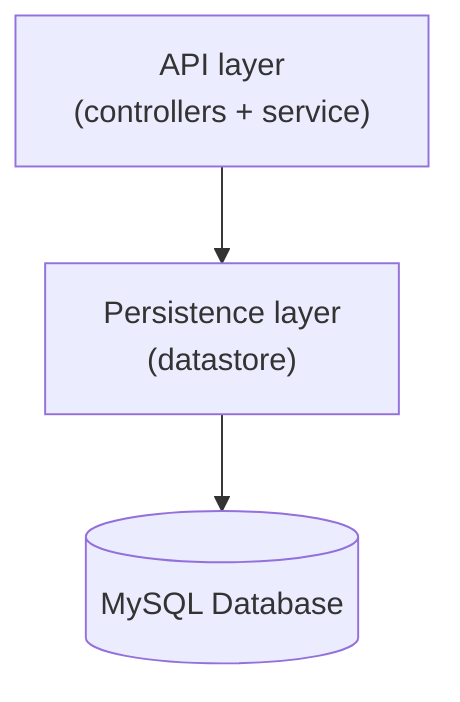
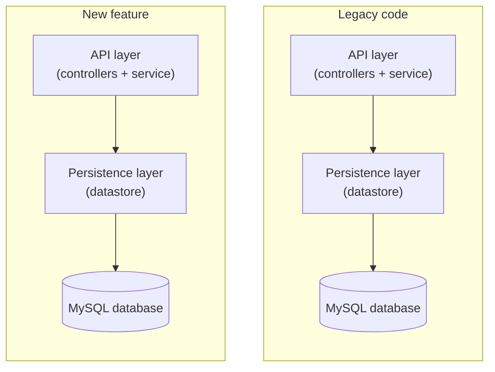
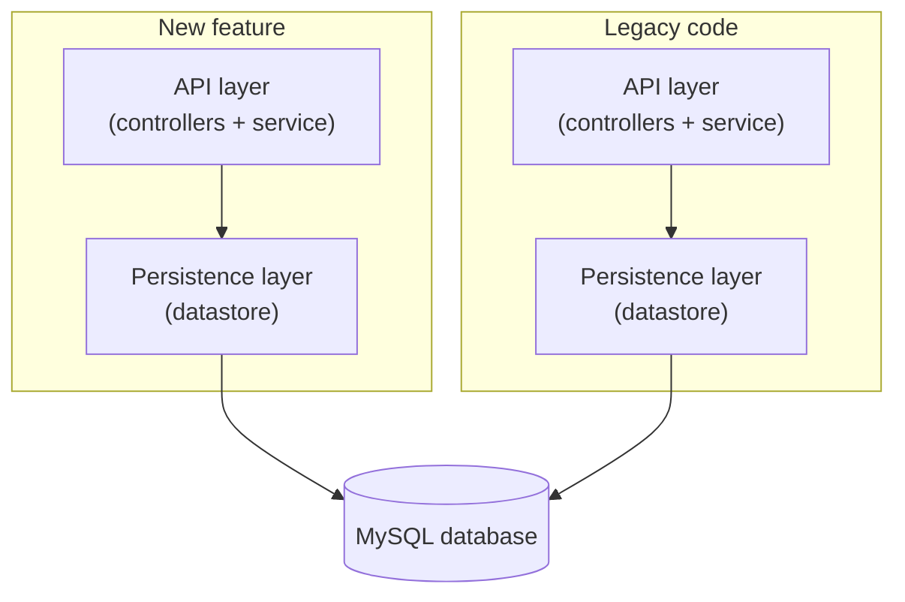
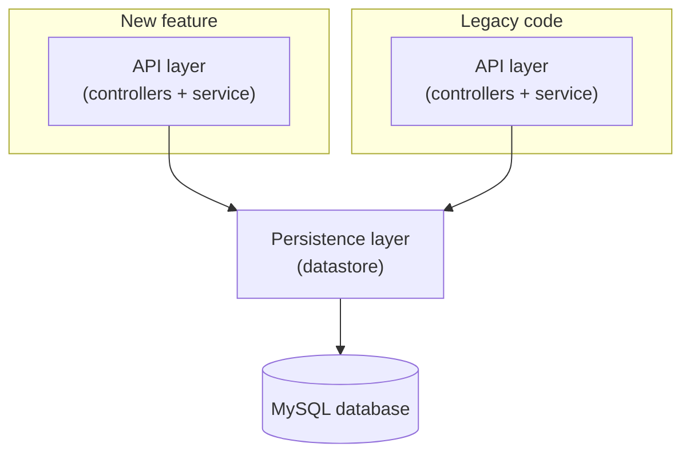
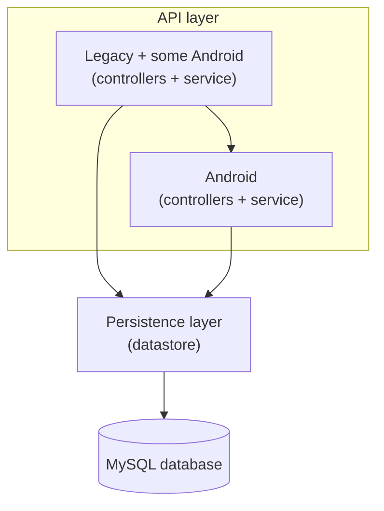

+++
title = "The modular monolith that wasn't"
description = "Our first attempt at modularizing a 500K-line codebase taught us more about team dynamics than architecture"
authors = ["Victor Lyuboslavsky"]
image = "modular-monolith-attempt.png"
date = 2025-11-26
categories = ["Software Development"]
tags = ["Software Architecture", "Developer Experience", "Technical Debt"]
draft = false
+++

A year ago I embarked on a journey to improve the architecture of our large 500K+ line open source
[device management codebase](https://github.com/fleetdm/fleet), and things haven't been quite as smooth as I'd hoped.

Although I've been in tech for over 25 years, I haven't worked on large web apps before. I've spent most of my time in
the semiconductor industry, working on a few smallish software projects. But I knew that going in, and I wanted to learn
more about software architecture so that I could improve the developer experience.

One of the things I did was listen to software podcasts and read books, including:

- Fundamentals of Software Architecture
- Learning Domain-Driven Design
- Clean Architecture
- and many others

The books largely agreed on [the benefits of modularity and cohesion](../software-modularity). Software should be
modular because that makes each module less complex, and hence easier to understand and maintain. The software inside a
module should be cohesive. In other words, the functionality of a module should belong together. Modularity is the best
way to scale a large software project. Then, engineers can focus on work in their own modules and minimize merge
conflicts with other engineers.

This all made sense to me, and it seemed like a well-trodden path by other software projects, especially those that
transitioned from a monolith to microservices. In our case, we were not going to transition to microservices, because
our customers needed to run our server on-prem, and we wanted to keep deployments simple. But we could transition to a
more modular architecture, called a modular monolith.

## Our web app architecture

Our web app is a 10-year-old monolith. It's a Go REST API built on top of a MySQL database.

The above diagram is a simplified core of our application. We have a single Go package for the API layer, which includes
controllers (Go handlers) and service (business logic). The service layer calls the persistence layer, which constructs
the SQL queries and executes them against our MySQL database. The API layer is one huge Go package, and the persistence
layer is another separate huge Go package.

## Evolutionary architecture proposal

At one of our engineering all-hands meetings, I gave a presentation about how we could
[scale our codebase to a more modular architecture](../scaling-codebase-evolutionary-architecture). One of the core
ideas of the presentation was that when working on a new feature, we could create a new module, a vertical slice, that
would mirror the structure of the legacy code. The approach would be similar to microservices, but still within a single
compiled binary.

The presentation seemed to go well, with general agreement. One comment was along the lines of "won't we have to redo
the architecture every time we reorganize our team structure?" The answer is maybe. The vertical slices have to make
sense from the product perspective. Also, the vertical slices can be small enough that a single team can own multiple
slices. If an engineering team splits in two, they can split their slices between them. If the team had one big slice,
then it makes sense to split that slice into two or more smaller slices.

## Initial implementation

We started working on a new feature, which seemed like an ideal candidate to try the new approach. The feature was
supporting Android MDM (Mobile Device Management). It would be a new platform with a new API. I did the work of creating
the new structure for the Android feature. I created new packages in a dedicated directory. Most of the work was
untangling the common parts so they can be reused between the legacy code and the new feature.

I put up the PR, and it just sat there. Our guidance is to review PRs within 24 hours, but no one wanted to touch this
one.

In retrospect, I should have done a better job communicating to the team that I was actually going to do what I
proposed. Some engineers felt surprised by the changes and didn't feel like they had a voice in the approach.

## First compromise

Having two MySQL schemas made our migrations more complicated. It also made it impossible to JOIN tables across schemas.
It would have made our deployments more complicated, even if the schemas were both in the same database. With the lack
of traction on my PR, I decided to take a step back and unsplit the MySQL layer.

After some long conversations with the PR reviewer, and a few smaller changes, we merged the PR.

## Second compromise

Around the same time, we instituted an ADR (Architecture Decision Record) process. I retroactively wrote two ADRs, one
to split the API layer and one to split the persistence layer for the Android feature. The
[ADR to split the API layer was approved](https://github.com/fleetdm/fleet/pull/29850), but the
[ADR to split the persistence layer was rejected](https://github.com/fleetdm/fleet/pull/29853).

Engineers voiced their concerns, which included:

- We've had this structure for a while, and people know how it works. Why do we need this change?
- With separate persistence layers, it will be much harder to do DB transactions across the two layers.
- This change is too big. Let's try something incremental, like splitting the API layer only.

So, I backed out the changes to the persistence layer.

## Architectural drift

I moved to another product team, where I worked on other parts of the codebase, and other engineers continued to work on
Android. Without architectural oversight and strong commitment from the engineering team, the Android feature seeped
into the legacy code.

So, what do we have now? Certainly, at a high level, the codebase doesn't look very modular. Arguably, it is even more
complex and harder to maintain than it was before. There is no clear separation between the legacy code and the Android
feature.

But it's not all bad news. Some positives remain:

- Most Android-specific controllers are in a separate package, which makes them easier to change and reason about.
- Some Android-specific code is now in a separate package, which speeds up development and testing in that package.
- We broke apart some common code out of the legacy package, which makes it easier to create new API layers.

## Lessons learned

We will continue our modularization efforts, and we will continue to improve our architecture. Let's sum up what we've
learned from our first attempt.

### Team buy in

We need to have a strong commitment from the engineers and managers for the new architecture and for the specific
architectural split we're proposing. Without this commitment, it is easy for engineers to fall back into old patterns
and start making architectural compromises. Without a manager's commitment, it is easy for the manager to encourage
engineers to do whatever is fastest to get the user story done.

### Better architectural governance

We need to have automated dependency checks to make sure developers aren't adding new dependencies that go against the
new architecture. We plan on investigating [arch-go](https://github.com/arch-go/arch-go) in the future. Since we don't
see many off-the-shelf tools for architectural governance of Go projects, we'll have to build our own as well.

In addition to automated checks, it makes sense for the architect to regularly review the codebase as a whole and
related PRs to catch any deviations from the architecture. With today's AI agents, it should be easy to make a prompt
for the AI agent to do this analysis.

### Controllers must access multiple services

We can't assume that a controller only needs to access our service layer. Sometimes, a controller needs to access
multiple services. In our case, an Android controller may need to access both the legacy service layer and the new
Android service. And similarly for a legacy controller. Hence, both the legacy and the new API layers must have
interface handles to each other.

The important thing is to assign the ownership of the API endpoint to a specific module, and to a specific team. Even
though the API endpoint may largely be an orchestrator, it is important to know what module it belongs to.

## Further reading

- **[6 business benefits of software modularity and cohesion](../software-modularity/)**  
  Understand why modularity matters for scaling teams and reducing complexity in growing codebases.

- **[Top code complexity metrics every software dev should know](../code-complexity-metrics/)**  
  Ways to measure and track code complexity to improve maintainability.

## Watch us TODO



_Note:_ If you want to comment on this article, please do so on the YouTube video.
