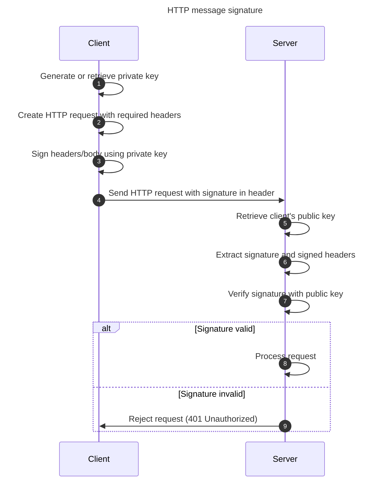

+++
title = "mTLS vs HTTP signature faceoff: securing your APIs"
description = "How mTLS and HTTP signatures work, where they fit best, and how to choose the right one for your architecture"
authors = ["Victor Lyuboslavsky"]
image = "mtls-vs-http-signature.png"
date = 2025-07-06
categories = ["Security"]
tags = ["Application Security", "mTLS", "TLS"]
draft = false
+++

## Table of Contents

- [What is mTLS?](#what-is-mtls)
- [mTLS: pros and cons](#mtls-pros-and-cons)
- [What is an HTTP message signature?](#what-is-an-http-message-signature)
- [HTTP message signature: pros and cons](#http-message-signature-pros-and-cons)
- [Performance Considerations](#performance-considerations)
- [What about replay attacks?](#what-about-replay-attacks)
- [mTLS vs HTTP message signatures: choosing the right tool](#mtls-vs-http-message-signatures-choosing-the-right-tool)

HTTP is the backbone of modern system communication. It lets your service confirm that it's talking to the device you
enrolled, not some impostor. It helps your backend recognize a microservice, not a malicious bot. And when it comes to
protecting those channels, you've got two popular weapons: mTLS and HTTP Message Signatures.

Both are powerful and secure, but they take radically different approaches. One is baked into the TLS handshake, tight
and deeply integrated. The other is explicit and flexible, wrapping your HTTP messages in cryptographic armor. This post
is a no-nonsense breakdown covering what they are, where they shine, and where they cause pain.

### What is mTLS?

In ordinary TLS (Transport Layer Security), only the server presents a certificate to the client. This way, the client
knows it is connecting to a legitimate server. In mutual TLS (mTLS), the client also presents a certificate to the
server so that the server can verify the client's identity.



mTLS is built into the TLS protocol (1.2 and 1.3) and is fast. The OS knows how to do it, and browsers know how to do
it. It's also commonly used in internal service meshes, Kubernetes clusters, secure databases, and private APIs where
mutual authentication is required.

We covered mTLS in greater detail in our [series on building an mTLS client using the system keystore](../mtls/).

### mTLS: pros and cons

**Pros**

- Built-in support across OSes, browsers, and web servers.
- Strong identity baked into the connection itself.
- No need to change application logic: TLS handles it.
- Integrates more broadly with native certificate stores (e.g., macOS Keychain), with more substantial support across
  existing OS-level and browser-based applications. However, your specific application may still need to implement its
  own integration to use these certificate stores.

**Cons**

- Hard to scope by endpoint. You either enforce mTLS on the whole server or not.
- Requires TLS termination at a layer that understands and enforces client authentication. For example, suppose a load
  balancer terminates the TLS connection (which is standard practice). In that case, it must handle client certificate
  verification and securely pass the authenticated identity to the downstream server.
- Not great for public APIs. Many clients (e.g., mobile apps, SDKs) don't handle client certificates well, making mTLS
  adoption difficult in heterogeneous environments

### What is an HTTP message signature?

HTTP message signatures are precisely what they sound like: you take an HTTP request, select a few headers (or maybe the
body), and sign them with a private key. The server uses the corresponding public key to verify that the request came
from someone it trusts.

HTTP signing works at the application layer. It does not replace TLS, but rides on top of it. That means you don't have
to worry about where TLS is terminated, and the HTTP signature can be verified at the ultimate destination server.

Many legacy systems have used their own approaches to HTTP signing. Apple's MDM protocol relies on a detached
[CMS signature](https://datatracker.ietf.org/doc/html/rfc5652) with a custom header, while GitHub uses HMAC-based
payload signing with a shared secret for webhooks. These mechanisms take different paths to the same goal: verifying the
integrity and origin of HTTP messages.

Today, more modern systems are beginning to align with [RFC 9421](https://datatracker.ietf.org/doc/html/rfc9421), a
proposed IETF standard for HTTP message signatures. The ecosystem is gradually converging on a shared standard for
signed HTTP requests. A common standard is beneficial when you don't control the client or want signature-level
auditability and control.

### HTTP message signature: pros and cons

**Pros**

- Fine-grained control: sign specific API paths, select which headers or body fields to include, and decide when to
  apply signing based on context.
- Signature verification works independently of TLS termination, enabling integrity checks even after a load balancer or
  proxy has terminated the TLS connection.
- Doesn't require X.509 certificates: keys can be created/exchanged directly, avoiding certificate issuance and renewal
  workflows. However, certificates can still be used if needed.
- Easier to debug: you can log and inspect the signature.
- Can integrate with system keystores (e.g., TPM) when supported by the client application.
- Signing/verification libraries for RFC 9421 are available.

**Cons**

- You must integrate/create the signing logic instead of relying on the OS or framework.
- You must manage replay attacks with nonce and/or timestamp protection
- Choosing which headers to sign isn't always obvious and can break interoperability. It can also break backward
  compatibility if header selection changes across client or server updates.

### Performance Considerations

mTLS is fast. The authentication step happens once per connection during the TLS handshake, and it benefits from all the
TLS acceleration and session reuse magic that your OS and hardware provide.

HTTP message signatures happen every time. Every request is signed. Every request is verified. You're layering crypto on
top of crypto. That means more CPU cycles, especially if your implementation isn't careful or you aren't using the most
efficient algorithms, such as ECDSA P-256. Performance will take a hit if you canonicalize huge headers or sign things
unnecessarily.

📌 **Important caveat:** For most APIs, performance is dominated by network and I/O. Unless you operate at a very high
scale or on constrained devices, the performance difference between mTLS and HTTP signatures might be negligible.

### What about replay attacks?

A replay attack occurs when a bad actor captures a legitimate request and replays it later to trigger the same action
again, such as resubmitting a money transfer or resetting a password.

**mTLS** helps mitigate replay attacks by tying authentication to a specific TLS session. An attacker can't simply
replay a captured request from another machine or session because they won't have access to the client's private key and
can't establish a valid mTLS session. That said, mTLS alone does not prevent replays of application-layer data if an
attacker somehow gains access to an active session (extremely unlikely).

**HTTP message signatures** require you to build your own defenses. Because there's no TLS session binding to a client
key, an attacker who captures a signed request can replay it from any machine. The attacker does not need the private
key, just the full request and its signature. That usually means you must include a `created` timestamp and/or `nonce`
in the signed headers and reject any request that's too old or already used. One way to do that would be:

- Server checks that `created` is within 10 minutes of current server time (since these fields are included in the
  signature, we know they have not been tampered with)
- Server checks that the `nonce` value has not been used within the last 10 minutes (nonce values can be cached with
  expiration in ValKey or Redis)

### mTLS vs HTTP message signatures: choosing the right tool

Here's how they compare:

| Feature                | mTLS                                            | HTTP Message Signature                             |
| ---------------------- | ----------------------------------------------- | -------------------------------------------------- |
| Identity verification  | 🟢 OS-level with client certs                   | 🟡 App-level with public key                       |
| Integrity              | 🟢 Built into TLS                               | 🟢 Signature over headers/body                     |
| Granular control       | 🔴 Hard to apply per route                      | 🟢 Easy                                            |
| Deployment complexity  | 🔴 High (requires certs and mTLS-aware proxies) | 🟡 Moderate (TLS termination agnostic)             |
| Public API suitability | 🔴 Poor (inconsistent client certs)             | 🟢 Good (no client certs needed)                   |
| Certificate handling   | 🔴 Requires full X.509 cert                     | 🟢 Supports raw public keys                        |
| Integration support    | 🟢 Strong OS/browser support                    | 🟡 App libraries available                         |
| Replay protection      | 🟡 Tied to TLS session                          | 🔴 Requires nonce and/or timestamp                 |
| Performance            | 🟢 Fast (once per connection)                   | 🟡 Moderate (on every request with efficient algo) |
| Debuggability          | 🔴 Opaque handshake                             | 🟢 Signature is visible                            |

So, which one should you use?

- Use **mTLS** when both ends are under your control. It is fast, OS-integrated, and well-supported for internal
  services or environments with managed certificates.
- Use **HTTP message signatures** when you need per-request control, flexible client support, or operate in ecosystems
  where certificate management is impractical.
- If you value **fine-grained control and debuggability**, HTTP signatures are a better fit 🟢.
- If you want **high performance and strong identity with minimal app changes**, mTLS is the clear choice 🟢, as long as
  you can handle the setup 🔴.
- In some architectures, **combining both** may offer the best of both worlds: transport-level trust with
  application-level verification.

Different tools for different jobs. Just don't skip authentication.

## Further reading

- [Using TPM 2.0 for secure key storage](../how-to-use-tpm/) Store private keys in hardware to protect API credentials,
  signing keys, and more.

## Watch us compare mTLS and HTTP message signatures



_Note:_ If you want to comment on this article, please do so on the YouTube video.
