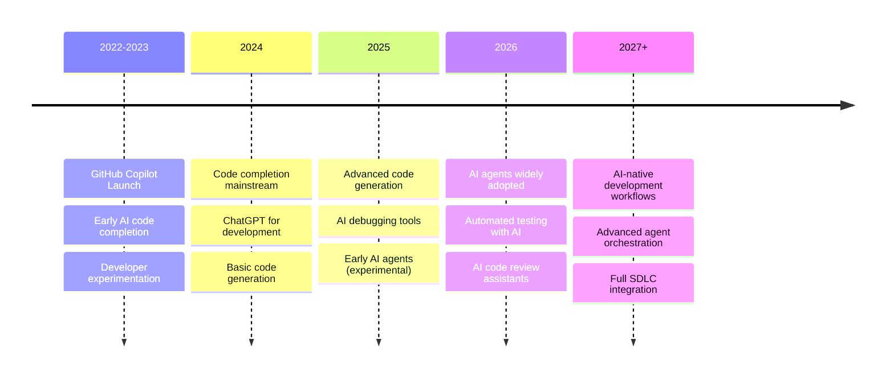
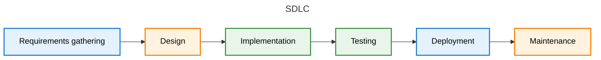
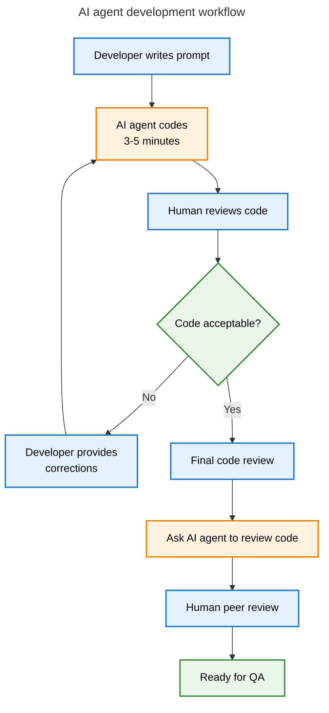

+++
title = "Will AI agents replace software developers?"
description = "A realistic look at how AI coding agents are reshaping software development and what engineers need to do to stay ahead"
authors = ["Victor Lyuboslavsky"]
image = "ai-agents-replace-developers-headline.png"
date = 2025-07-16
categories = ["Software Development"]
tags = ["AI", "Agentic AI", "Developer Experience", "Engineering Management"]
draft = false
+++

**TL;DR:** AI coding agents are becoming mainstream, but their impact is focused mainly on implementation and automated
testing. Productivity gains are real but capped, and engineers must still actively guide and supervise these tools.
Complete developer replacement is unlikely anytime soon.

- [Requirements gathering](#requirements-gathering)
- [Design](#design)
- [Implementation](#implementation)
- [Testing](#testing)
- [Deployment](#deployment)
- [Maintenance](#maintenance)
- [AI coding agent impact across the SDLC](#ai-coding-agent-impact-across-the-sdlc)
- [Will AI coding agents replace software developers?](#will-ai-coding-agents-replace-software-developers)

## Introduction

AI is no longer just autocomplete. With AI coding agents, it is becoming a collaborator. But what happens when that
collaborator starts writing and testing entire chunks of your codebase? Will software engineers become managers of
fleets of AI agents, or will their jobs evolve in less dramatic ways?

Our previous article covered the [AI trends in the first half of 2025](../ai-for-software-developers/). Using AI for
code completion and code generation was becoming mainstream. Today, in the second half of 2025, we can expect most
software developers to be using AI, off and on, for these tasks. But what about using AI coding agents to make
significant changes to the codebase, including automatically running and fixing tests? Recent surveys show that most
software engineers are NOT using AI agents. With AI code completion tools like GitHub Copilot being widely adopted
within about one year, we can reasonably assume that AI agents will likewise be widely adopted by the second half
of 2026. With that in mind, what will a typical engineer's day look like in 2026?

### AI tools adoption timeline in software development

Let's walk through the software development lifecycle (SDLC) and understand where these new AI coding agents can be
used. We will focus specifically on the new capabilities that AI coding agents bring, and not on the existing and
largely mainstream capabilities of AI code completion and chatbots.

## Requirements gathering

In requirements gathering, we need to figure out why we are adding a feature and what the feature is, at a high level.
We have two major sources of product features. The first one is a strategic feature that will open up new sources of
revenue for us. The second is a customer request, which we must build to keep our customers happy. A single feature
could be both of these.

To understand the customer, we actually need to talk to the customer. Barring that, we could do market analysis to see
what similar features our competition has. ChatGPT can speed up this process by aggregating and explaining the
information. In this case, ChatGPT makes research more efficient, much like Google made research more efficient than
going to the library. But this is not a new AI use case. Product managers have been using AI to speed up their work for
years now.

As far as figuring out what we're building and why, AI coding agents may have little to add. That said, they may have
some use cases, such as writing a script to fetch and analyze data from a public API.

_Note:_ Requirements gathering combines the planning and requirements analysis phases, assuming we use a fast-paced
Agile iterative process.

## Design

In the design phase, we get into the details of what we're building. We specify the UI requirements, API changes,
integrations with other services, and other technical requirements.

### Spike stories and proof of concepts (POCs)

Often, there are enough uncertainties in the feature that software engineers must do a spike story or build a POC. A
spike story is an Agile user story to research a technical question. Spike stories uncover things like:

- Technical feasibility (e.g., can we use TPM to sign HTTP messages?)
- Implementation approach (e.g., should we use webhooks or polling?)
- Integration behavior (e.g., how does this 3rd party API handle pagination and errors?)
- Tool or library evaluation (e.g., does this 3rd party library provide all the features we need?)
- Unknown complexities or risk (e.g., will this actually work?)

In a spike story or POC, we often write quick throwaway code without other architectural considerations, such as
maintainability. And this is where AI coding agents can help. Theoretically, an AI coding agent can create a whole POC
with only a cursory review from the software developer. But this is an extreme case. In most cases, the work will be a
mix of coding, reviewing technical documentation, searching the web, and talking with ChatGPT.

So, with the help of an AI coding agent, we could finish our spike story faster. If the work was timeboxed, the end
result should be higher quality.

### Final design

After the spike story, we still need to finish the design, providing all the technical specifications required for
estimation and implementation. These details include an understanding of how this feature interacts with all the other
parts of our application, such as:

- UI
- configuration
- authentication
- monitoring and logging
- error handling
- scalability and performance
- internationalization

Although some of these aspects are shared between features, we, as software developers, still need to consider and
investigate the new feature's implications. AI coding agents are of little help here, besides providing boilerplate
requirements.

## Implementation

After the feature has been designed and estimated, it is time to get down to the work of coding. Can an AI agent do all
of this? Well, we may not be able to take the design and feed it to our agent. A product manager or another engineer may
have done the design, and this design may lack enough details for implementation. So we have to add details, like:

- Function names (e.g., `sendEmailNotification`)
- Constant and enum names (e.g., `RoleAdmin`)
- File and package structure (e.g., `handlers/user.go`)
- Error handling strategy (e.g., wrap errors and add context)
- Interface design (e.g., create a new interface to simplify testing)
- Security considerations (e.g., validate inputs)

Yes, an AI coding agent may indeed come up with some of these on its own. However, we must consciously consider these to
ensure our codebase is maintainable, testable, scalable, and handles corner cases.

So, once we know what we need to code, we can write a prompt to the AI coding agent and let it do its work. Today's AI
coding agents are not very fast. In our experience, we ask an AI agent to do a chunk of work, and it completes it in
several minutes. Then we do a brief review of what it did and come back to it with corrections. Corrections often
include things like:

- Using the correct coding standards for our codebase
- Removing unneeded code (e.g., handling cases that we know cannot happen)
- Removing/merging duplicate code
- Using better names for functions/variables (e.g., don't use `err2`)

If we let the AI agent do a bigger chunk of work (30+ minutes), there is a greater chance that it will go off the rails,
and all the work must be redone. For example, an AI agent could decide to implement a third-party library itself because
it couldn't figure out how to use the existing one.

Once we reach a good stopping point, we need to review all the code changes that we and our AI agent have made. Since
much of the code was autogenerated, we must take extra care to do a thorough review. The goal is to fully understand the
implementation so that we can speak about it as if we coded all of it ourselves.

Once we have checked in the code or opened a PR, we can ask another AI agent to review it. With multiple LLMs and coding
agents out there, it is good practice to have one AI agent check the work of another AI agent for anything that we may
have missed. Unfortunately, this means wading through a few false positives. However, the end result is higher-quality
code that is ready for one of our peers to review.

### Multitasking with multiple AI agents

Some developers report using multiple AI agents to work on numerous projects simultaneously. In our workflow, this
approach is not practical. We know from behavioral science research that it takes a human up to 15 minutes to entirely
switch between different tasks because they must reload and recall all of the context associated with the new task into
their brain. So, if we switch between tasks every 5-10 minutes, the result is that we're never deeply engaged with any
of these tasks, likely leading to lower quality software.

Perhaps two AI coding agents can work on two tasks for the same feature. However, in this case, the two tasks must be
independent, which is more of an exception than the norm.

Even if we decide to save some time by switching from AI agent coding to a longer task, such as a code review for one of
our peers, when we return to the agent, we will need to recall what we told the agent to do and what our expectations
were.

### Integration with the rest of the codebase

A lot of software development work involves hooking up the feature into the existing codebase. For example, we need to
create the new object and properly do dependency injection. These things often only take a few lines of code. Although
AI coding agents can do these integrations, it is often just as fast and more reliable to manually code these smaller
snippets.

### Full stack development

AI coding agents can help you write in a programming language you're unfamiliar with. The agent will do the brunt work,
getting the syntax (mostly) right, and you can review the code to make sure it looks reasonable. This means software
developers can easily expand beyond their functional specialty into other languages and parts of the codebase.

From an SDLC perspective, a single feature is now more likely to be assigned to a single developer instead of being
partitioned across backend/frontend or server/client boundaries. In this case, a single developer should be able to
finish a feature faster, without the handoffs and the issues they entail.

Overall, AI coding agents can significantly help speed up the implementation phase. However, we must note that AI agent
effectiveness varies by task. Specifically, agents struggle with complex/niche designs and unfamiliar contexts.

## Testing

The two main testing areas are automated tests, including unit and integration tests, and manual tests.

### Automated (unit) tests

Writing tests has been a primary use case for generative AI over the past few years. So, given detailed instructions
regarding the scenarios to test, an AI coding agent should be able to write the test, run the test, and fix any issues.
The software developer will still need to review and adjust the tests. Some common problems with agent-generated tests
include:

- Not following project standards regarding the test helper methods being used (e.g., wrong HTTP client, wrong assert
  method)
- Wordy and hard to maintain tests (e.g., not following a table test approach, not using subtests)
- Duplicated tests (e.g., testing a case that was covered elsewhere in the test suite)
- Using numbers in test variables instead of descriptive names (e.g., rsp1, err2)
- Not actually testing anything (e.g., hard-coding test expectations in the source implementation)

The AI agent may come up with some corner cases to test, but it cannot be relied on for full functional correctness.
Since the AI agent can see the implementation, it often bases its tests on what has been implemented. It lacks an
understanding of the intended requirements and, hence, what should be tested.

### Manual tests

Before handing over the implementation to the QA team, the software developer should review the test plan themselves and
perform all the manual tests. Any issues found can be candidates for additional automated tests.

There is no AI agent today that can replace manual testers, but engineers can try to take advantage of AI to help in
some areas:

- Convert natural language to test steps
- Identify visual (UI) regressions
- Accessibility testing
- Auto-healing tests: updating tests when UI changes

So, for the testing phase, AI coding agents provide much help with creating and fixing automated tests, but not so much
with manual testing.

## Deployment

Before deploying the app to customers, engineers should do a release readiness check covering items like:

- All committed features implemented
- Testing and QA complete
- Security checks passed
- Load testing complete

After deployment, engineers should conduct smoke tests and health checks to ensure the app is working.

In addition, deployment involves communication tasks, such as:

- demos, guides, FAQs
- release notes and changelogs

Generative AI is being used to generate some communication content. AI coding agents can provide little additional value
in the deployment phase.

## Maintenance

The maintenance phase of the software development lifecycle includes:

- Answering customer and internal questions
- Responding to alerts and incidents (e.g., investigating high CPU usage, resolving a failed background job)
- Reproducing and fixing customer-reported bugs

AI search tools have been helpful with searching the codebase and documentation to answer questions. Some upcoming tools
are trying to close the loop between production monitoring and source code fixes, and this is a great area to watch.
Reproducing bugs is still very much a manual process.

Fixing bugs is an implementation task, so AI coding agents can help create the fix and a unit test. However, bug fixes
tend to be small in nature, with most of the software engineer's time spent figuring out where the bug is and how best
to fix it.

## AI coding agent impact across the SDLC

| SDLC Phase           | AI Agent Impact | 🔍 Notes                                                         |
| -------------------- | --------------- | ---------------------------------------------------------------- |
| 📝 Requirements      | ❌ Low          | Some research support, but little for strategic/product thinking |
| 🧠 Design            | ⚠️ Low–Medium   | Help limited to spike stories and boilerplate                    |
| 💻 Implementation    | ✅ High         | Most benefit seen here (code gen, agent pair programming)        |
| 🧪 Automated Testing | ✅ High         | Strong at generating/fixing tests, needs human oversight         |
| 🧍 Manual Testing    | ❌ Low          | Still mostly a human-driven process                              |
| 🚀 Deployment        | ❌ Low          | Some help with writing release notes, limited technical role     |
| 🔧 Maintenance       | ⚠️ Medium       | Good at fixes; weak at reproducing or analyzing issues           |

## Risk and tradeoffs

While AI coding agents offer clear benefits, they also introduce new risks and tradeoffs that teams must actively
manage:

- **Shallow code understanding**: Engineers may be tempted to rely on agents without fully understanding the generated
  code. This erodes accountability and leads to slower debugging when issues arise.
- **Inconsistent quality**: Agent-generated code can be verbose, redundant, or subtly incorrect. Without careful review,
  these issues can slip into production.
- **Developer deskilling**: Over-reliance on agents may reduce hands-on practice with fundamentals, particularly for
  junior engineers who are still developing intuition.
- **Security and compliance**: Agents can unknowingly introduce vulnerabilities or use unsafe patterns, especially when
  integrating with third-party APIs or handling sensitive data.

In short, AI agents amplify output, but without discipline and oversight, they can amplify problems too. Teams must
treat agent-generated code with **greater** rigor than human-written code.

## Will AI coding agents replace software developers?

Recent studies suggest that current AI tools improve productivity by 10% to 20%.

- [AI speeds up Google engineers by 21%](https://arxiv.org/abs/2410.12944)
- [JPMorgan claims AI boosts efficiency by up to 20%](https://nypost.com/2025/03/14/business/jpmorgan-credits-coding-assistant-tool-for-boosting-engineers-efficiency/)
- [Atlassian says AI is saving over 10 hours per week](https://www.itpro.com/software/development/atlassian-says-ai-has-created-an-unexpected-paradox-for-software-developers-theyre-saving-over-10-hours-a-week-but-theyre-still-overworked-and-losing-an-equal-amount-of-time-due-to-organizational-inefficiencies)
- [AI slows down some developers](https://www.reuters.com/business/ai-slows-down-some-experienced-software-developers-study-finds-2025-07-10)

So, will the productivity improvements jump with AI coding agents becoming mainstream? Will one engineer be able to do
the work of a whole team?

Looking at the whole software development process, we see that the most significant gains from AI coding agents are in
the implementation and automated testing phases. The consensus from studies and industry reports is that software
engineers spend only about 30% of their time writing code. The rest of the time is spent in the other phases of the
SDLC, as well as on other tasks such as:

- attending and preparing for meetings (e.g., planning, retros, 1:1s)
- mentoring, teaching, and continuous learning
- context switching and task juggling
- recruiting, interviewing, and candidate evaluation
- writing or reviewing internal documentation, ADRs, and RFCs
- developer advocacy, blogging, and community engagement
- travel for conferences, offsites, or customer visits
- improving tooling, automation, and developer environments

Even assuming AI agents completely automate coding tasks (30% of work), the maximum productivity gain would be 43%: if
70% of work remains unchanged, then 30% time savings translates to doing 1.43x the work. In other words, 7 people can
now do the work of 10 people. This is far from the popular claims that AI will replace all software engineers.



In summary, AI in general and AI coding agents in particular should continue to have a noticeable impact on software
developer productivity. However, developers' work is complex and varied, and AI can only provide efficiency improvements
and not wholesale replacement. AI coding agents won't replace developers, but developers who know how to use them will
replace those who don't.

## Further reading

- **[How to use AI for software development (2025)](../ai-for-software-developers/)**  
  _What every software engineer needs to know about AI right now: code completion, generation, and AI agents._

- **[Introducing MCP: Lessons from building an AI-driven server](../introducing-mcp/)**  
  _How we taught an AI agent to use our product with MCP._

## Watch us discuss whether AI agents can replace software developers



_Note:_ If you want to comment on this article, please do so on the YouTube video.
